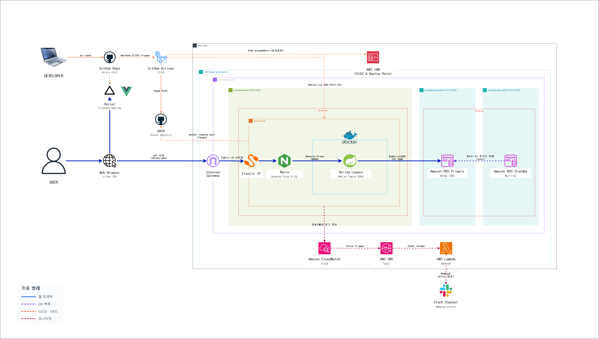
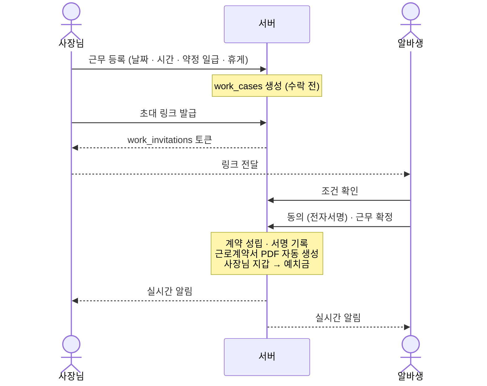
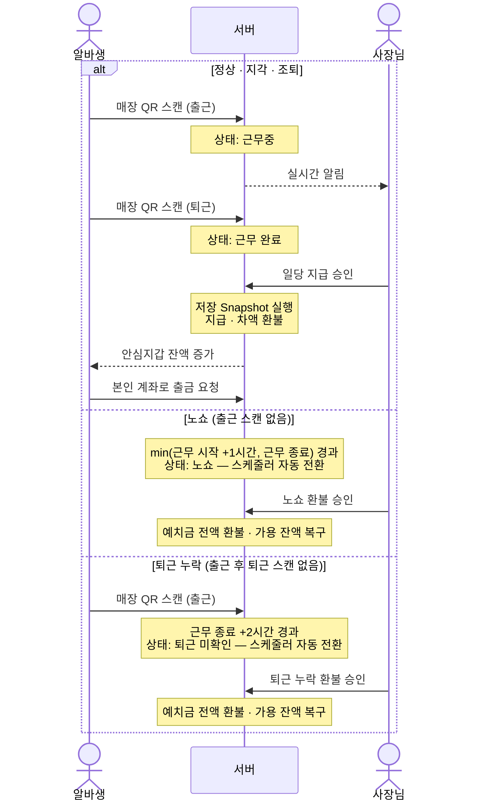

<div align="center">

<picture>
  <source media="(prefers-color-scheme: dark)" srcset="frontend/src/assets/images/logo/logo-gighub-darkmode.png" />
  
</picture>

<br>

**단기 알바 임금 체불을 막는 서비스입니다.**

사장님이 근무를 등록하면 약정 일급이 전자지갑에서 예치되고,
알바생이 QR로 출퇴근하면 그 예치금이 지급되거나 환불됩니다.

[](frontend/package.json)
[](backend/build.gradle)
[](backend/build.gradle)
[](compose.yaml)

**[서비스 바로가기](https://gighub.store)**

KB IT's Your Life 7기 · 24-2팀

</div>

---

## ✨ 주요 기능

### 🏪 사장님

- **사업장 관리** — 도로명주소 서버 좌표 변환 기반 등록·수정과 목록 조회, 매장에 붙이는 고정 QR 발급·재발급
- **근무 등록** — 날짜·시간·약정 일급·휴게시간을 정해 근무를 만들고, 수락 전까지 수정·삭제
- **초대 링크** — 근무별로 링크를 발급해 알바생에게 전달, 필요하면 재발급
- **전자지갑** — 충전과 출금, 거래내역 조회
- **자동 예치** — 알바생이 근무를 확정하면 약정 일급이 지갑에서 예치금으로 잡힘
- **정산** — 정상·지각·조퇴 근무의 저장 Snapshot 지급·차액 환불, 노쇼·퇴근 누락의 예치금 전액 환불 승인
- **문서함** — 근로계약서와 공유받은 보건증 열람
- **신뢰 뱃지** — 이용 이력 기반 등급 확인

### 🙋 알바생

- **근무 확정** — 초대 링크로 조건을 확인하고 전자서명에 동의해 계약 성립
- **오늘의 알바** — 홈에서 당일 근무와 출근 가능 시각 확인
- **QR 출퇴근** — 매장 고정 QR을 스캔해 출근·퇴근 기록
- **안심지갑** — 잔액과 거래내역 조회, 본인 계좌로 출금
- **근로계약서** — 확정 시각 기준으로 자동 생성된 계약서 열람
- **보건증** — 업로드 후 사업장별로 공유하고, 필요하면 공유 철회
- **이의 제기** — 근무 관련 분쟁 접수와 이력 조회
- **신뢰 뱃지** — 이용 이력 기반 등급 확인

### 🔐 안전장치

- **세션 인증 + CSRF** — 토큰을 브라우저에 저장하지 않고 `JSESSIONID` 세션만 사용, 상태 변경 요청에 CSRF 헤더 자동 첨부
- **멱등 요청** — 충전·출금·수락·정산에 `Idempotency-Key`를 실어 더블클릭이나 네트워크 재시도로 인한 이중 반영 차단
- **노쇼 자동 판정** — `min(근무 시작+1시간, 근무 종료)`까지 출근 기록이 없으면 스케줄러가 상태를 전환
- **계약서 자동 파기** — 보존 기간 3년이 지난 근로계약서를 매일 새벽 정리
- **인앱 알림** — 최신·안읽음 목록과 단건·전체 읽음 처리, SSE 재조회 신호로 새 이벤트 안내
- **문서 접근 감사** — 누가 어떤 문서를 열었는지 기록

> 정상 근무는 약정 일급 전액을 지급하고, 지각·조퇴는 저장된 근태 Snapshot으로 비례 지급·차액 환불합니다. 노쇼·퇴근 누락은 별도 승인 뒤 전액 환불합니다.

---

## 🛠 기술 스택

| 영역 | 스택 |
| --- | --- |
| Frontend | Vue 3 · Vue Router · Pinia · Axios · Vite · Vitest |
| Backend | Java 17 · Spring Framework 5 · Spring Security · MyBatis · Tomcat 9 |
| Database | MySQL 8.4 · Flyway |
| 인프라 | Vercel · nginx · Docker Compose on EC2 · GHCR · GitHub Actions |
| 운영 알림 | CloudWatch → SNS → Lambda → Slack |
| 개발 도구 | ESLint · Prettier · Checkstyle · Husky · lint-staged |

설명이 필요한 부분만 덧붙입니다.

- Spring Boot를 쓰지 않습니다. 애노테이션 기반 Spring Framework 5 설정으로 WAR를 만들어 외부 Tomcat 9에 올립니다.
- SQL은 전부 MyBatis Mapper XML에 있습니다. 자바 코드에 쿼리를 섞지 않습니다.
- 스키마는 Flyway 마이그레이션이 원본입니다. 다만 애플리케이션이 마이그레이션을 자동 실행하지는 않습니다.

버전은 [`frontend/package.json`](frontend/package.json)과 [`backend/build.gradle`](backend/build.gradle)에 있습니다.

---

## 🏗 시스템 아키텍처

전체 구성입니다. 사용자 요청, DB 복제, 배포, 모니터링 경로를 선 색으로 구분했습니다.



- TLS는 nginx에서 끝납니다. Tomcat은 루프백에만 바인딩되어 있어 외부에서 직접 접근할 수 없습니다.
- DB는 프라이빗 서브넷에 있습니다. 애플리케이션 컨테이너만 접근하고, Primary는 다른 AZ의 Standby로 동기 복제됩니다.
- 배포 권한은 OIDC로 받습니다. GitHub Actions가 `AssumeRole`로 임시 자격증명을 받기 때문에 IAM 액세스 키를 저장소에 두지 않습니다.
- SSH 22번은 배포하는 동안만 엽니다. 배포·마이그레이션·시드 워크플로가 실행할 때마다 러너 IP `/32` 규칙을 보안그룹에 넣었다가 `if: always()`로 회수합니다. 그림의 `Deploy via SSH (Port:22)`가 이 구간입니다. 상시 열린 22번 규칙이 따로 있는지는 아직 확인하지 못했습니다([`deploy/SETUP.md`](deploy/SETUP.md) 2절).
- 마이그레이션은 배포와 분리돼 있습니다. 애플리케이션은 이전 이미지로 바로 롤백되지만 이미 적용된 DDL은 되돌아오지 않아서, 사람이 직접 실행해야 돌아갑니다.
- Lambda 알림 함수는 자동 배포되지 않습니다. 코드는 `deploy/lambda/slack-alert/`에 있고 반영은 수동입니다.

서버 구성, 배포·롤백 절차, 모니터링 설정은 [배포 환경 구성](deploy/SETUP.md)에 있습니다.

---

## 🚀 시작하기

### 필수 요구사항

- Git
- Java 17
- Node.js `>=20.19.0 <25`, npm `>=11 <12`
- Docker (로컬 MySQL · Flyway)
- 외부 Tomcat 9

### 설치

루트와 프론트엔드는 서로 다른 lockfile을 씁니다. 각각 설치합니다.

```sh
git clone https://github.com/KB-24-2-GigHub/KB-PJT-24-2.git
cd KB-PJT-24-2

npm ci
npm --prefix frontend ci
```

### 환경 변수

```sh
cp .env.example .env
cp frontend/.env.example frontend/.env
```

| 파일 | 키 | 기본값 | 설명 |
| --- | --- | --- | --- |
| `.env` | `MYSQL_PORT` | `3307` | 로컬 MySQL 노출 포트 |
| `.env` | `MYSQL_DATABASE` | `kb_pjt` | 데이터베이스 이름 |
| `.env` | `MYSQL_USER` · `MYSQL_PASSWORD` | — | 애플리케이션 계정 |
| `.env` | `MYSQL_ROOT_PASSWORD` | — | root 비밀번호 |
| `frontend/.env` | `VITE_API_BASE_URL` | `/api` | Axios base URL |
| `frontend/.env` | `DEV_PROXY_TARGET` | `http://localhost:8080` | Vite `/api` 프록시 대상 |
| `frontend/.env` | `DEV_ALLOWED_HOSTS` | (비움) | HTTPS 터널 접속 시에만 사용 — 실기기 카메라·위치는 보안 컨텍스트 필요 |
| `frontend/.env` | `VITE_USE_MOCK` | `false` | 레거시 Auth·User 데모 어댑터 전용 |
| `frontend/.env` | `VITE_MOCK_OPERATIONS` | (비움) | 개발 환경에서 Operation 단위 mock 선택 (예: `wallet.fetchWallet`) |

### 데이터베이스

```sh
docker compose up -d db
npm run db:migrate
```

애플리케이션은 Flyway를 자동 실행하지 않습니다. Tomcat을 켜기 전에 마이그레이션을 마칩니다.

### 백엔드 실행

```sh
cd backend
./gradlew war    # build/libs/gig-hub.war
```

생성된 WAR를 외부 Tomcat 9에 배포합니다.

### 프론트엔드 실행

```sh
npm --prefix frontend run dev
```

개발 서버는 `http://localhost:5173`에 고정되어 있습니다. 서버가 `/api/**`의 인증 포함 CORS를 이 Origin에서만 허용하므로 포트를 바꾸면 로그인이 막힙니다.

### 검증

```sh
npm run check      # 가드레일 · 하네스 테스트 · 프론트 테스트 · 프론트 빌드 · 프론트/백엔드 린트
npm run test:fe    # 프론트 단위 테스트만
```

`npm run check`는 CI가 실행하는 것과 같은 명령입니다.

### 기타 스크립트

| 명령 | 설명 |
| --- | --- |
| `npm run db:migrate` | Flyway 마이그레이션 적용 |
| `npm run db:seed:contract` | 계약·예치 테스트 시드 |
| `npm run db:seed:demo` | 전체 초기화 후 시연 상태 재생성 (확인값 필요) |
| `npm run db:fixture:invite` | 초대 수락 E2E 사전 데이터 |
| `npm run build:fe` | 프론트 프로덕션 빌드 |

---

## 📁 프로젝트 구조

```text
KB-PJT-24-2/
├── frontend/
│   └── src/
│       ├── components/
│       ├── composables/
│       ├── layouts/
│       ├── router/
│       ├── services/
│       ├── stores/
│       └── views/
├── backend/
│   └── src/main/
│       ├── java/com/gighub/
│       └── resources/
│           ├── mappers/
│           └── db/migration/
├── deploy/
├── docs/
├── scripts/
├── .github/workflows/
└── compose.yaml
```

| `frontend/src/` | 내용 |
| --- | --- |
| `components/` | 재사용 UI |
| `composables/` | 뱃지 · 수익 틱 · 문서 미리보기 |
| `layouts/` | 역할별 탭 레이아웃 |
| `router/` | 화면 경로와 가드 |
| `services/` | Axios 클라이언트와 도메인 API |
| `stores/` | Pinia 상태 |
| `views/` | 화면 — `auth` · `owner` · `worker` · `invite` · `error` |

| `backend/src/main/` | 내용 |
| --- | --- |
| `java/com/gighub/config/` | Root · MVC · DB 초기화 |
| `java/com/gighub/<도메인>/` | `auth` · `member` · `badge` · `workplace` · `work` · `invitation` · `contract` · `attendance` · `wallet` · `settlement` · `bank` · `document` · `notification` · `idempotency` |
| `resources/mappers/` | MyBatis Mapper XML |
| `resources/db/migration/` | Flyway 마이그레이션 |

도메인 패키지는 `controller` → `service` → `mapper` → `dto` 계층을 따릅니다. `attendance`는 QR·위치 기반 출퇴근을, `idempotency`는 금융성 요청 중복 차단을 맡습니다.

---

## 📋 주요 플로우

### 1. 근무 등록 → 초대 → 수락 → 예치

계약 성립과 예치는 같이 끝납니다. 둘 중 하나만 되면 계약은 됐는데 돈은 안 묶인 상태가 생깁니다.



### 2. QR 출퇴근 → 정산 / 노쇼·퇴근 누락 환불

정상 근무는 전액 지급, 지각·조퇴는 비례 지급 후 차액 환불, 노쇼와 퇴근 누락은 승인을 거쳐
전액 환불입니다. 어느 경우든 지급액과 환불액을 더하면 처음 예치한 금액이 됩니다.



---

## 🌐 API 연동

> **[Swagger UI에서 API 살펴보기](https://api.gighub.store/swagger-ui/index.html)** — 실행 중인 서버의 엔드포인트와 요청·응답 스키마를 직접 확인할 수 있습니다.

### 연동 규약

| 항목 | 내용 |
| --- | --- |
| Base URL | `VITE_API_BASE_URL` (기본 `/api`) · 로컬은 Vite 프록시로 Tomcat에 전달 |
| 인증 | **세션 전용** — `JSESSIONID` 쿠키. accessToken을 저장하거나 전송하지 않음 |
| CSRF | `XSRF-TOKEN` 쿠키를 읽어 모든 상태 변경 요청에 `X-XSRF-TOKEN` 자동 첨부 |
| 성공 응답 | `{ data }` 를 벗겨 본문만 전달 |
| 오류 응답 | `{ code, message, traceId, fieldErrors }` — 폼 필드 매핑에 사용 |
| 401 처리 | 세션을 버리고 온보딩으로 이동. 초대 딥링크는 알바생 로그인으로 복귀 경로 보존 |
| 멱등성 | 금융성 요청에 `Idempotency-Key` 헤더. 서버가 응답한 4xx는 재시도하지 않음 |
| 시각 표현 | API는 UTC `Instant` 문자열, DB는 `Asia/Seoul` 벽시계 값 |

### 도메인별 엔드포인트

| 도메인 | 주요 경로 |
| --- | --- |
| 인증 | `POST /api/auth/signup` · `/login` · `/logout` <br/> `GET /api/auth/csrf` · `/session` · `/login-id-availability` · `/email-availability` |
| 회원 · 뱃지 | `GET · PATCH /api/users/me` · `PATCH /api/users/me/password` · `POST /api/users/me/withdrawal` · `GET /api/users/me/badge` |
| 사업장 | `POST · GET /api/workplaces` · `PATCH /api/workplaces/{id}` · Legacy `PUT /api/workplaces/{id}/coordinates` |
| QR | `GET /api/workplaces/{id}/qr` · `POST /api/workplaces/{id}/qr/reissue` |
| 근무 | `POST · GET /api/workplaces/{id}/work-cases` · `GET /api/workplaces/{id}/work-cases/summary` <br/> `GET · PATCH · DELETE /api/work-cases/{id}` |
| 초대 | `POST /api/work-cases/{id}/invitations` · `/invitations/reissue` <br/> `GET /api/invitations/{token}` · `POST /api/invitations/{token}/accept` |
| 알바생 | `GET /api/worker/home` · `/work-cases` · `/workplaces` |
| 출퇴근 | `POST /api/attendance/scans` |
| 지갑 | `GET /api/wallet` · `/api/wallet/transactions` <br/> `POST /api/wallet/funding-orders` · `/api/wallet/withdrawal-requests` |
| 정산 | `POST /api/work-cases/{id}/settlement/approve` · `/settlement/no-show-refund/approve` · `/settlement/check-out-missing-refund/approve` |
| 이의 | `POST · GET /api/work-cases/{id}/disputes` |
| 문서 | `GET · POST /api/documents` · `GET · PATCH · DELETE /api/documents/{id}` <br/> `GET /api/documents/{id}/file` · `POST · GET /api/documents/{id}/shares` · `DELETE /api/documents/{id}/shares/{workplaceId}` |
| 알림 | `GET /api/notifications` · `/unread-count` <br/> `PATCH /api/notifications/{id}/read` · `/api/notifications/read-all` · `GET /api/notifications/stream` |
| 헬스 | `GET /api/health` |

요청·응답 필드의 확정 계약은 `docs/specs/API_SPEC.md`에 있습니다.

---

## 🤝 기여 방법

1. 기본 통합 브랜치는 `dev`입니다.
2. Issue 템플릿(버그 / 기능 / 작업) 중 맞는 것으로 Issue를 먼저 만듭니다.
3. 커밋 메시지는 [`docs/COMMIT_CONVENTION.md`](docs/COMMIT_CONVENTION.md)를 따릅니다. Husky 훅이 형식을 검사합니다.
4. PR 전에 `npm run check`를 통과시킵니다. CI가 같은 명령을 실행합니다.
5. 명세와 DB 마이그레이션은 CODEOWNER 승인이 필요한 보호 경로입니다.

전체 개발 문서는 [`docs/README.md`](docs/README.md)에서 찾습니다.

---

## 📄 License

이 저장소에는 아직 `LICENSE` 파일이 없습니다.

---

## 👥 팀

KB IT's Your Life 7기 · 24-2팀

| 이름 | GitHub | 담당 |
| --- | --- | --- |
| 김인범 | [@Flamingo7562](https://github.com/Flamingo7562) | |
| 이돈녕 | [@donnyeonglee](https://github.com/donnyeonglee) | |
| 이현서 | [@hyunseo2503](https://github.com/hyunseo2503) | |
| 최정원 | [@dkgkrltlfgek](https://github.com/dkgkrltlfgek) | |
| 하성민 | [@hsm9411](https://github.com/hsm9411) | |

<div align="center">

**GigHub** · KB IT's Your Life 7기 24-2팀

</div>
