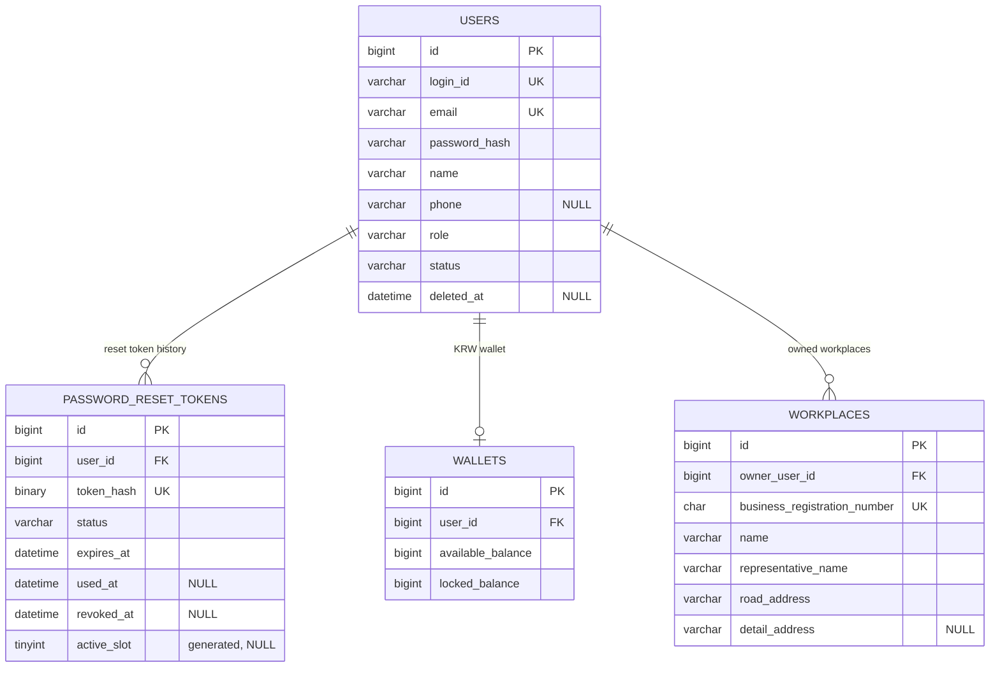
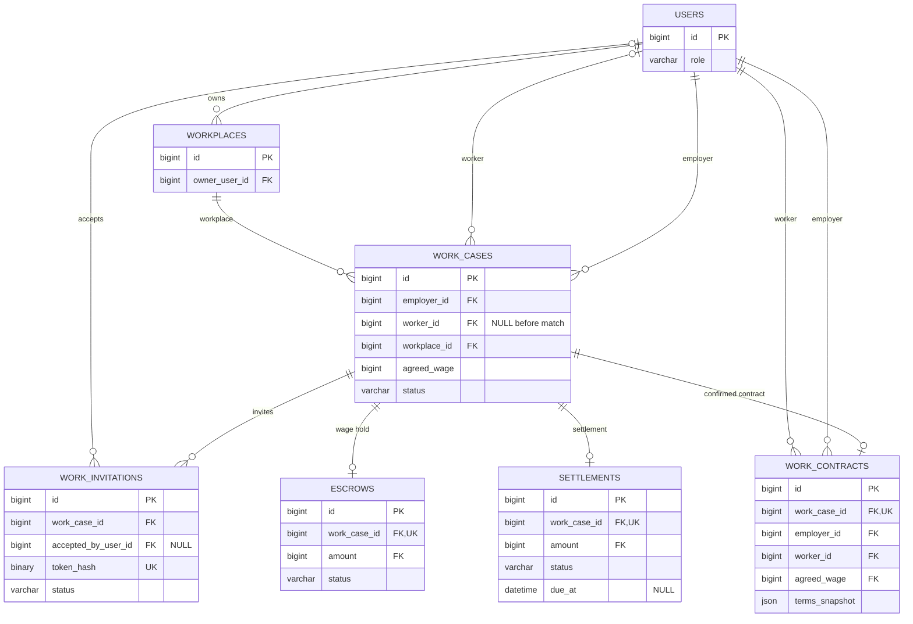
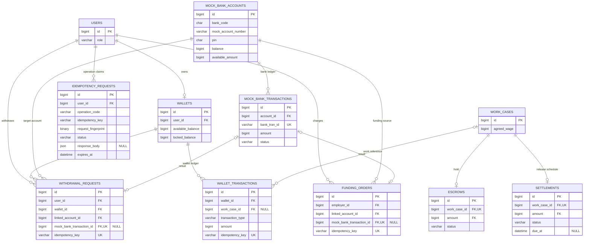
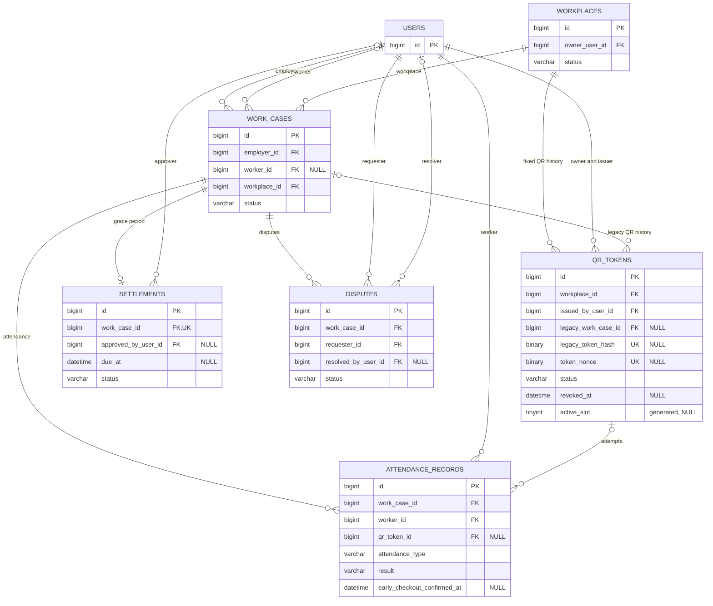
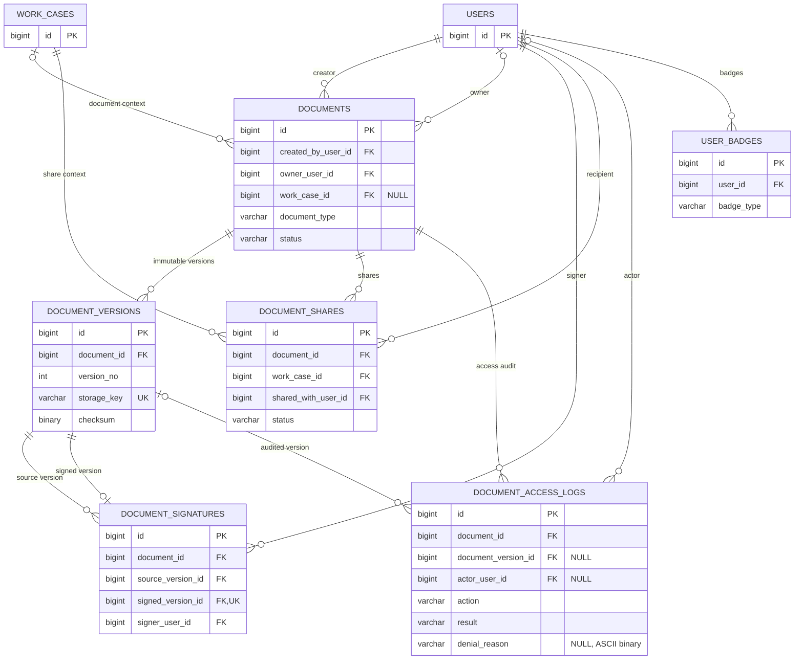

# Gig-Hub 전체 DB 스키마와 기능별 ERD

> 저장소 원본: `docs/DATABASE_SCHEMA_ERD.md`
>
> 기준: 로컬 Docker MySQL 8.4, Flyway Schema Version `202608111744`
>
> 범위: 도메인 테이블 24개와 Flyway 내부 관리 테이블 1개, 총 25개입니다.
>
> 읽기용 통합 DDL: [`database/schema-snapshot-202608111744.sql`](database/schema-snapshot-202608111744.sql)
>
> 편집 정책: Migration과 통합 DDL은 프로젝트 소유자 전용입니다. 에이전트는 소유자가 변경한
> 스키마를 근거로 이 설명 문서만 갱신할 수 있습니다.

현재 소유자 승인 기준은 Head `202608111744`의 Migration 14개·도메인 테이블 24개입니다.
사업장 고정 QR `202607311427`, 비밀번호 재설정 Token `202607311428`, 퇴근 누락 상태
`202607311429`, OWNER Profile 제거 `202608041138`, 멱등 요청 Claim `202608041614`, Mock 계좌
비귀속 PIN 전환 `202608051337`, 문서 접근 감사 상세 `202608061428`, 문서 감사 allowlist
`202608111743`, 뱃지 유형 allowlist `202608111744`를 모두 현재 스키마로 사용합니다.

## 한 장 요약

Gig-Hub 데이터베이스는 `users`를 중심으로 회원, 사업장, 근무, 지갑, 근태와 문서 기능을 연결합니다. 사장님과 근로자는 별도 회원 테이블로 나누지 않고 `users.role`로 구분합니다. OWNER 식별정보는 `users`, 사업체·사업장 기준정보는 `workplaces`에 저장하며 한 사용자는 여러 사업장을 가질 수 있습니다. Mock 계좌는 사용자에게 소유·귀속되지 않는 합성 계좌입니다. 별도 OWNER Profile 테이블은 사용하지 않습니다. 로그인 아이디와 이메일은 각각 고유하고, 회원 탈퇴 상태에서는 `deleted_at`이 반드시 기록되어야 합니다. 비밀번호 재설정 원문 Token은 DB에 저장하지 않고 `password_reset_tokens.token_hash`로만 추적합니다. `flyway_schema_history`는 업무 데이터가 아니라 적용한 Migration의 버전·체크섬·성공 여부를 기록합니다.

근무 흐름의 중심은 `work_cases`입니다. 한 근무 건은 사장님과 사업장을 반드시 가지며 근로자는 초대 전까지 비어 있을 수 있습니다. 초대 수락 후에는 `work_contracts`에 조건을 스냅샷으로 보존하고, 계약 당사자와 일급이 원래 근무 건과 달라질 수 없도록 복합 외래키로 묶습니다. `escrows`와 `settlements`는 근무 건당 최대 한 건이며 금액은 확정 일급과 같아야 합니다. `due_at`은 자동 정산 예정 시간을 저장할 뿐이고 DB Scheduler나 Trigger는 없습니다. 실제 자동 지급은 추후 Spring Scheduler가 수행합니다.

자금은 `mock_bank_accounts`, `wallets`, `escrows`로 분리합니다. Mock 계좌에는 숫자 네 자리 Demo PIN을 저장하며 사용자 FK는 없습니다. 지갑의 `available_balance`만 사용·출금 가능하고 `locked_balance`는 에스크로 예치액입니다. 충전·출금 요청과 지갑 원장은 멱등 키를 고유값으로 저장하여 같은 요청이 중복 반영되지 않게 설계했습니다. `idempotency_requests`는 사용자·Operation별 요청 Claim과 최초 성공 응답을 별도로 저장합니다. Mock 은행 거래와 지갑 거래는 서로 다른 원장이고, 실제 금융망과 연결되지 않습니다.

사업장에는 nonce 기반 고정 QR을 하나만 활성화할 수 있습니다. 재발급 시 기존 QR을 `REVOKED`로 남기며, 과거 근무·동작별 QR도 `legacy_*` 컬럼으로 보존합니다. 실제 출퇴근 시도와 조기 퇴근 확인 시각은 `attendance_records`에 기록합니다. 분쟁은 근무 건별 활성 건을 제한합니다. 문서는 논리 정보인 `documents`, 불변 파일 버전인 `document_versions`, 서명 증거인 `document_signatures`, 공유와 접근 감사 테이블로 나뉩니다. 모든 외래키 삭제 정책은 `RESTRICT`이므로 과거 계약·정산·문서 기록이 연결된 부모 행은 임의 삭제할 수 없습니다.

`work_cases.status`는 성공 출근 후 퇴근이 없는 근무를 `NO_SHOW`와 구분하기 위한
`CHECK_OUT_MISSING`을 허용하고 해당 상태에 배정 근로자를 요구합니다. 이 DDL 사실만
승인됐으며 판정 시점·실행 주체·해소·정산 흐름은 아직 미정입니다. 근로계약서는 시스템만
생성해 근로일 이후 3년간 보존한 뒤 백엔드가 자동 삭제하고, 사업장 인증 반경은 100m로
사용한다는 제품 결정도 아래에서 현재 DB 보장 범위와 분리해 설명합니다.

DB의 “시점” 컬럼은 `DATETIME(6)`이며 timezone 정보를 자체 보존하지 않습니다. 서버는 이를 `Asia/Seoul` 현지 시각으로 저장·해석하고, HTTP API에서는 UTC `Instant` 문자열(`...Z`)로 변환합니다. 날짜 자체가 의미인 `DATE` 컬럼은 Java `LocalDate`로 다룹니다. 이 문서는 현재 적용된 DB 구조를 설명하며, 스키마가 있다고 해서 비밀번호 재설정·고정 QR API가 이미 구현된 것은 아닙니다.

표기법은 `PK`가 기본키, `FK`가 외래키, `UK`가 고유키입니다. `NULL` 주석이 있는 컬럼만 선택값이고 나머지는 모두 `NOT NULL`입니다. 관계선의 `||`는 정확히 하나, `o|`는 0 또는 1, `o{`는 0개 이상을 뜻합니다.

## 1. 전체 스키마

```mermaid
erDiagram
    USERS {
        bigint id PK
        varchar login_id UK
        varchar email UK
        varchar password_hash
        varchar name
        varchar phone "NULL"
        varchar role
        varchar status
        datetime deleted_at "NULL"
        datetime created_at
        datetime updated_at
    }

    PASSWORD_RESET_TOKENS {
        bigint id PK
        bigint user_id FK
        binary token_hash UK
        varchar status
        datetime expires_at
        datetime used_at "NULL"
        datetime revoked_at "NULL"
        tinyint active_slot "generated, NULL"
        datetime created_at
    }

    WALLETS {
        bigint id PK
        bigint user_id FK
        char currency
        bigint available_balance
        bigint locked_balance
        datetime created_at
        datetime updated_at
    }

    MOCK_BANK_ACCOUNTS {
        bigint id PK
        char bank_code
        varchar mock_account_number
        char pin
        varchar mock_fintech_use_num UK
        char currency
        bigint balance
        bigint available_amount
        varchar status
        datetime created_at
        datetime updated_at
    }

    WORKPLACES {
        bigint id PK
        bigint owner_user_id FK
        char business_registration_number UK
        varchar name
        varchar representative_name
        varchar road_address
        varchar detail_address "NULL"
        varchar phone
        decimal latitude "NULL"
        decimal longitude "NULL"
        decimal radius_meters
        varchar status
        datetime deleted_at "NULL"
        datetime created_at
        datetime updated_at
    }

    WORK_CASES {
        bigint id PK
        bigint employer_id FK
        bigint worker_id FK "NULL"
        bigint workplace_id FK
        varchar title
        datetime starts_at
        datetime ends_at
        smallint break_minutes
        tinyint break_paid
        varchar workplace_name
        varchar workplace_address
        decimal workplace_latitude "NULL"
        decimal workplace_longitude "NULL"
        decimal allowed_radius_meters
        bigint agreed_wage
        int terms_version
        varchar status
        datetime canceled_at "NULL"
        datetime created_at
        datetime updated_at
    }

    WORK_INVITATIONS {
        bigint id PK
        bigint work_case_id FK
        binary token_hash UK
        varchar status
        int expected_terms_version
        datetime expires_at
        bigint accepted_by_user_id FK "NULL"
        int accepted_terms_version "NULL"
        datetime accepted_at "NULL"
        datetime rejected_at "NULL"
        datetime revoked_at "NULL"
        tinyint active_slot "generated, NULL"
        datetime created_at
    }

    WORK_CONTRACTS {
        bigint id PK
        bigint work_case_id FK, UK
        bigint employer_id FK
        bigint worker_id FK
        varchar title
        datetime starts_at
        datetime ends_at
        smallint break_minutes
        tinyint break_paid
        varchar workplace_name
        varchar workplace_address
        decimal workplace_latitude "NULL"
        decimal workplace_longitude "NULL"
        decimal allowed_radius_meters
        bigint agreed_wage FK
        int source_terms_version
        json terms_snapshot
        datetime accepted_at
        datetime created_at
    }

    MOCK_BANK_TRANSACTIONS {
        bigint id PK
        bigint account_id FK
        varchar bank_tran_id UK
        varchar transfer_type
        bigint amount
        bigint balance_before
        bigint balance_after
        varchar reference_type
        bigint reference_id
        varchar status
        varchar failure_code "NULL"
        datetime created_at
    }

    FUNDING_ORDERS {
        bigint id PK
        bigint employer_id FK
        bigint linked_account_id FK
        bigint expected_amount
        bigint transferred_amount "NULL"
        bigint mock_bank_transaction_id FK, UK "NULL"
        varchar idempotency_key UK
        varchar status
        varchar failure_code "NULL"
        datetime completed_at "NULL"
        datetime created_at
        datetime updated_at
    }

    IDEMPOTENCY_REQUESTS {
        bigint id PK
        bigint user_id FK
        varchar operation_code
        varchar idempotency_key
        binary request_fingerprint
        varchar status
        smallint response_http_status "NULL"
        json response_body "NULL"
        datetime completed_at "NULL"
        datetime expires_at
        datetime created_at
        datetime updated_at
    }

    WITHDRAWAL_REQUESTS {
        bigint id PK
        bigint user_id FK
        bigint wallet_id FK
        bigint linked_account_id FK
        bigint amount
        bigint mock_bank_transaction_id FK, UK "NULL"
        varchar idempotency_key UK
        varchar status
        varchar failure_code "NULL"
        datetime completed_at "NULL"
        datetime created_at
        datetime updated_at
    }

    WALLET_TRANSACTIONS {
        bigint id PK
        bigint wallet_id FK
        bigint work_case_id FK "NULL"
        varchar transaction_type
        bigint amount
        bigint available_before
        bigint available_after
        bigint locked_before
        bigint locked_after
        varchar reference_type
        bigint reference_id
        varchar idempotency_key UK
        datetime created_at
    }

    ESCROWS {
        bigint id PK
        bigint work_case_id FK, UK
        bigint amount FK
        varchar status
        datetime held_at "NULL"
        datetime released_at "NULL"
        datetime refunded_at "NULL"
        datetime on_hold_at "NULL"
        datetime created_at
        datetime updated_at
    }

    QR_TOKENS {
        bigint id PK
        bigint workplace_id FK
        bigint issued_by_user_id FK
        bigint legacy_work_case_id FK "NULL"
        binary legacy_token_hash UK "NULL"
        binary token_nonce UK "NULL"
        varchar legacy_action "NULL"
        varchar status
        datetime legacy_expires_at "NULL"
        datetime legacy_used_at "NULL"
        datetime revoked_at "NULL"
        tinyint active_slot "generated, NULL"
        datetime created_at
    }

    ATTENDANCE_RECORDS {
        bigint id PK
        bigint work_case_id FK
        bigint worker_id FK
        bigint qr_token_id FK "NULL"
        varchar attendance_type
        datetime captured_at
        datetime attempted_at
        decimal distance_meters "NULL"
        decimal accuracy_meters "NULL"
        varchar result
        varchar failure_reason "NULL"
        datetime early_checkout_confirmed_at "NULL"
        tinyint success_slot "generated, NULL"
        datetime created_at
    }

    SETTLEMENTS {
        bigint id PK
        bigint work_case_id FK, UK
        bigint amount FK
        varchar status
        bigint approved_by_user_id FK "NULL"
        datetime due_at "NULL"
        datetime processing_at "NULL"
        datetime completed_at "NULL"
        varchar failure_code "NULL"
        datetime created_at
        datetime updated_at
    }

    DISPUTES {
        bigint id PK
        bigint work_case_id FK
        bigint requester_id FK
        varchar dispute_type
        text content
        varchar status
        text resolution "NULL"
        bigint resolved_by_user_id FK "NULL"
        datetime resolved_at "NULL"
        tinyint open_slot "generated, NULL"
        datetime created_at
        datetime updated_at
    }

    DOCUMENTS {
        bigint id PK
        bigint created_by_user_id FK
        bigint owner_user_id FK
        bigint work_case_id FK "NULL"
        varchar document_type
        varchar status
        date issued_on "NULL"
        date expires_on "NULL"
        datetime created_at
        datetime updated_at
    }

    DOCUMENT_VERSIONS {
        bigint id PK
        bigint document_id FK
        int version_no
        varchar version_type
        varchar storage_key UK
        varchar mime_type
        bigint size_bytes
        binary checksum
        datetime created_at
    }

    DOCUMENT_SIGNATURES {
        bigint id PK
        bigint document_id FK
        bigint source_version_id FK
        bigint signed_version_id FK, UK
        bigint signer_user_id FK
        binary source_checksum
        binary signed_checksum
        varchar typed_name
        varchar signature_method
        datetime consented_at
        datetime signed_at
        datetime created_at
    }

    DOCUMENT_SHARES {
        bigint id PK
        bigint document_id FK
        bigint work_case_id FK
        bigint shared_with_user_id FK
        varchar purpose
        varchar status
        datetime expires_at "NULL"
        datetime revoked_at "NULL"
        tinyint active_slot "generated, NULL"
        datetime created_at
    }

    DOCUMENT_ACCESS_LOGS {
        bigint id PK
        bigint document_id FK
        bigint document_version_id FK "NULL"
        bigint actor_user_id FK "NULL"
        varchar action
        varchar result
        varchar denial_reason "NULL, ASCII binary"
        datetime created_at
    }

    USER_BADGES {
        bigint id PK
        bigint user_id FK
        varchar badge_type
        json evidence
        datetime awarded_at
    }

    FLYWAY_SCHEMA_HISTORY {
        int installed_rank PK
        varchar version "NULL"
        varchar description
        varchar type
        varchar script
        int checksum "NULL"
        varchar installed_by
        timestamp installed_on
        int execution_time
        tinyint success
    }

    USERS ||--o{ PASSWORD_RESET_TOKENS : "requests password reset"
    USERS ||--o| WALLETS : "owns KRW wallet"
    USERS ||--o{ WORKPLACES : "owns workplaces"
    USERS ||--o{ WORK_CASES : "employs"
    USERS o|--o{ WORK_CASES : "works in"
    WORKPLACES ||--o{ WORK_CASES : "contains"
    WORK_CASES ||--o{ WORK_INVITATIONS : "issues"
    USERS o|--o{ WORK_INVITATIONS : "accepts"
    WORK_CASES ||--o| WORK_CONTRACTS : "snapshots"
    USERS ||--o{ WORK_CONTRACTS : "employer party"
    USERS ||--o{ WORK_CONTRACTS : "worker party"
    MOCK_BANK_ACCOUNTS ||--o{ MOCK_BANK_TRANSACTIONS : "records"
    USERS ||--o{ FUNDING_ORDERS : "requests funding"
    USERS ||--o{ IDEMPOTENCY_REQUESTS : "claims operations"
    MOCK_BANK_ACCOUNTS ||--o{ FUNDING_ORDERS : "funding source"
    MOCK_BANK_TRANSACTIONS o|--o| FUNDING_ORDERS : "funding result"
    USERS ||--o{ WITHDRAWAL_REQUESTS : "requests withdrawal"
    WALLETS ||--o{ WITHDRAWAL_REQUESTS : "withdraws from"
    MOCK_BANK_ACCOUNTS ||--o{ WITHDRAWAL_REQUESTS : "withdrawal target"
    MOCK_BANK_TRANSACTIONS o|--o| WITHDRAWAL_REQUESTS : "withdrawal result"
    WALLETS ||--o{ WALLET_TRANSACTIONS : "records"
    WORK_CASES o|--o{ WALLET_TRANSACTIONS : "references"
    WORK_CASES ||--o| ESCROWS : "locks wage"
    WORKPLACES ||--o{ QR_TOKENS : "has fixed QR history"
    USERS ||--o{ QR_TOKENS : "owns and issues"
    WORK_CASES o|--o{ QR_TOKENS : "legacy QR history"
    WORK_CASES ||--o{ ATTENDANCE_RECORDS : "records attendance"
    USERS ||--o{ ATTENDANCE_RECORDS : "worker attempts"
    QR_TOKENS o|--o{ ATTENDANCE_RECORDS : "used by"
    WORK_CASES ||--o| SETTLEMENTS : "settles"
    USERS o|--o{ SETTLEMENTS : "approves"
    WORK_CASES ||--o{ DISPUTES : "has disputes"
    USERS ||--o{ DISPUTES : "requests"
    USERS o|--o{ DISPUTES : "resolves"
    USERS ||--o{ DOCUMENTS : "creates"
    USERS ||--o{ DOCUMENTS : "owns"
    WORK_CASES o|--o{ DOCUMENTS : "relates to"
    DOCUMENTS ||--o{ DOCUMENT_VERSIONS : "versions"
    DOCUMENT_VERSIONS ||--o{ DOCUMENT_SIGNATURES : "source version"
    DOCUMENT_VERSIONS ||--o| DOCUMENT_SIGNATURES : "signed version"
    USERS ||--o{ DOCUMENT_SIGNATURES : "signs"
    DOCUMENTS ||--o{ DOCUMENT_SHARES : "shares"
    WORK_CASES ||--o{ DOCUMENT_SHARES : "share context"
    USERS ||--o{ DOCUMENT_SHARES : "receives"
    DOCUMENTS ||--o{ DOCUMENT_ACCESS_LOGS : "audits"
    DOCUMENT_VERSIONS o|--o{ DOCUMENT_ACCESS_LOGS : "audited version"
    USERS o|--o{ DOCUMENT_ACCESS_LOGS : "acts"
    USERS ||--o{ USER_BADGES : "earns"
```

### 핵심 복합·상태 제약

| 영역                 | DB 제약                                                                                                                                                  |
| -------------------- | -------------------------------------------------------------------------------------------------------------------------------------------------------- |
| 회원·비밀번호 재설정 | `login_id`, `email` 고유. 역할은 `OWNER/WORKER/ADMIN`, 상태는 `ACTIVE/INACTIVE/LOCKED/WITHDRAWN`. Token Hash는 고유하고 사용자별 활성 재설정 Token은 1개 |
| 사업장               | 사업자등록번호 10자리 고유. `(owner_user_id, id)`로 근무 건의 사업장 소유권 검증                                                                         |
| 근무                 | 상태는 `DRAFT/ACCEPTED/READY/IN_PROGRESS/CHECK_OUT_MISSING/COMPLETED/NO_SHOW/CANCELED`. 종료 시각은 시작 이후이고 확정 이후 상태는 `worker_id` 필수      |
| 초대                 | Token Hash 고유. 생성 컬럼 `active_slot`으로 근무 건당 활성 초대 1개 제한                                                                                |
| 계약                 | 근무 건당 1개. `(work_case_id, employer_id, worker_id, agreed_wage)`가 원 근무 건과 일치                                                                 |
| 지갑·Mock 계좌       | Mock 계좌는 사용자 비귀속. 통화는 KRW 고정, PIN은 ASCII 숫자 4자리, 계좌 가용액은 총액 이하. 계좌·거래번호·멱등 키 고유                                  |
| 멱등 요청 Claim      | `(user_id, operation_code, idempotency_key)`별 1개. 완료 Claim은 2xx 상태와 JSON 응답 Snapshot을 함께 보존                                               |
| 에스크로·정산        | 근무 건당 각각 1개. `(work_case_id, amount)`가 확정 일급과 일치                                                                                          |
| QR·근태·분쟁         | 사업장별 nonce 기반 활성 QR 1개. 발급자는 해당 사업장 소유자. 근무 건과 출퇴근 유형별 성공 기록 1개. 생성 컬럼으로 근무 건당 열린 분쟁 1개 제한          |
| 문서                 | 근무 건과 문서 유형별 1개. 저장 키와 문서별 버전 번호 고유. 서명 원본·완성 버전은 서로 달라야 함                                                         |
| 삭제                 | 모든 FK는 `ON DELETE RESTRICT`, `ON UPDATE RESTRICT`                                                                                                     |

QR과 비밀번호 재설정의 상태·형태 제약은 다음과 같습니다.

- 신규 고정 QR 행은 `token_nonce`만 가지고 상태가 `ACTIVE` 또는 `REVOKED`입니다. `REVOKED`이면 `revoked_at`이 반드시 있고, 그 외 상태에서는 없어야 합니다.
- 기존 근무·동작별 QR 행은 `legacy_token_hash`, `legacy_work_case_id`, `legacy_action`, `legacy_expires_at`을 보존하며 `ACTIVE`로 되돌릴 수 없습니다. Migration 적용 시 기존 `ACTIVE` 행은 즉시 `REVOKED` 처리됩니다.
- Migration은 적용 시점에 `ACTIVE` 사업장마다 무작위 16바이트 nonce를 가진 고정 QR 행을 하나씩 만듭니다. `active_slot` 고유키가 이후에도 사업장별 활성 행을 하나로 제한합니다.
- 비밀번호 재설정은 `ACTIVE`, `USED`, `EXPIRED`, `REVOKED` 상태를 사용합니다. `USED`만 `used_at`, `REVOKED`만 `revoked_at`을 요구하며 사용자별 `ACTIVE` 행은 하나뿐입니다.
- 멱등 요청 Claim은 `PROCESSING`, `COMPLETED` 상태를 사용합니다. `COMPLETED` 행만 2xx 상태·응답 Snapshot·완료 시각을 가지며 만료 시각은 생성 시각 이후여야 합니다.
- `work_cases.status=CHECK_OUT_MISSING`은 허용되고 배정 근로자가 필수지만, DB는 성공 출근·퇴근 부재나 상태 판정 시점을 검증하지 않습니다.
- `attendance_records.early_checkout_confirmed_at`은 성공한 `CHECK_OUT` 행에서만 기록할 수 있습니다.

### 상태 외 문자열 도메인 CHECK 목록

아래 컬럼은 자유 문자열이 아니라 DB의 이름 있는 `CHECK` 제약으로 허용값이 제한됩니다. 모두 `NOT NULL`이며, 기본값이 `-`인 컬럼은 INSERT할 때 값을 반드시 직접 넣어야 합니다.

| 영역           | 테이블.컬럼                            | 허용 문자열                                                                                                  | 기본값 | CHECK 제약명                              |
| -------------- | -------------------------------------- | ------------------------------------------------------------------------------------------------------------ | ------ | ----------------------------------------- |
| 회원           | `users.role`                           | `OWNER`, `WORKER`, `ADMIN`                                                                                   | -      | `ck_users_role`                           |
| 통화           | `wallets.currency`                     | `KRW`                                                                                                        | `KRW`  | `ck_wallets_currency`                     |
| 통화           | `mock_bank_accounts.currency`          | `KRW`                                                                                                        | `KRW`  | `ck_mock_bank_accounts_currency`          |
| Mock 은행 거래 | `mock_bank_transactions.transfer_type` | `WITHDRAW`, `DEPOSIT`                                                                                        | -      | `ck_mock_bank_transactions_transfer_type` |
| 지갑 원장      | `wallet_transactions.transaction_type` | `FUNDING`, `ESCROW_HOLD`, `ESCROW_RELEASE`, `ESCROW_REFUND`, `WITHDRAWAL`, `WITHDRAWAL_REFUND`, `ADJUSTMENT` | -      | `ck_wallet_transactions_type`             |
| QR 과거 이력   | `qr_tokens.legacy_action`              | `CHECK_IN`, `CHECK_OUT` 또는 `NULL`                                                                          | -      | `ck_qr_tokens_legacy_action`              |
| 근태           | `attendance_records.attendance_type`   | `CHECK_IN`, `CHECK_OUT`                                                                                      | -      | `ck_attendance_records_type`              |
| 근태           | `attendance_records.result`            | `SUCCESS`, `REJECTED`                                                                                        | -      | `ck_attendance_records_result`            |
| 문서           | `documents.document_type`              | `EMPLOYMENT_CONTRACT`, `HEALTH_CERTIFICATE`                                                                  | -      | `ck_documents_type`                       |
| 문서 버전      | `document_versions.version_type`       | `ORIGINAL`, `SIGNED`                                                                                         | -      | `ck_document_versions_type`               |
| 전자서명       | `document_signatures.signature_method` | `TYPED_NAME`, `DRAWN`                                                                                        | -      | `ck_document_signatures_method`           |
| 문서 공유      | `document_shares.purpose`              | `CONTRACT_PARTY`, `HEALTH_CERTIFICATE`                                                                       | -      | `ck_document_shares_purpose`              |
| 문서 접근 감사 | `document_access_logs.result`          | `ALLOWED`, `DENIED`                                                                                          | -      | `ck_document_access_logs_result`          |

현재 이 문자열 컬럼들은 `utf8mb4_0900_ai_ci` Collation을 사용합니다. 따라서 `OWNER`와 `owner`를 같은 값으로 비교하므로, 위 표는 표준 표기이지만 DB가 영문 대소문자까지 엄격히 강제하지는 않습니다. 대문자 표기 자체가 필수 정책이면 에이전트는 필요한 Collation 또는 `BINARY` CHECK 변경을 소유자에게 보고하고, 후속 Flyway Migration의 작성 여부는 소유자가 결정합니다.

### 문자열 형식 CHECK 목록

| 테이블.컬럼                                                       | 형식 제약                                  | NULL | CHECK 제약명                                                       |
| ----------------------------------------------------------------- | ------------------------------------------ | ---- | ------------------------------------------------------------------ |
| `mock_bank_accounts.bank_code`                                    | 숫자 3자리                                 | 불가 | `ck_mock_bank_accounts_bank_code`                                  |
| `mock_bank_accounts.mock_account_number`                          | 앞뒤 공백을 제거한 뒤 한 글자 이상         | 불가 | `ck_mock_bank_accounts_account_number`                             |
| `mock_bank_accounts.pin`                                          | ASCII 숫자 4자리                           | 불가 | `ck_mock_bank_accounts_pin`                                        |
| `workplaces.business_registration_number`                         | 숫자 10자리                                | 불가 | `ck_workplaces_business_registration_number`                       |
| `workplaces.name`, `representative_name`, `road_address`, `phone` | 각 값이 앞뒤 공백 제거 후 한 글자 이상     | 불가 | `ck_workplaces_required_text`                                      |
| `workplaces.detail_address`                                       | `NULL` 또는 앞뒤 공백 제거 후 한 글자 이상 | 가능 | `ck_workplaces_detail_address`                                     |
| `idempotency_requests.operation_code`, `idempotency_key`          | 빈 문자열 불가, ASCII 대소문자 구분        | 불가 | `ck_idempotency_requests_operation`, `ck_idempotency_requests_key` |
| `document_access_logs.action`                                     | 승인된 문서 접근 행위 다섯 종류             | 불가 | `ck_document_access_logs_action`                                   |
| `document_access_logs.denial_reason`                              | NULL 또는 승인된 거부 사유 다섯 종류        | 가능 | `ck_document_access_logs_denial_reason`                            |
| `user_badges.badge_type`                                          | `TRUST_OWNER` 또는 `TRUST_WORKER`          | 불가 | `ck_user_badges_type`                                              |

### 아직 유한값 CHECK가 없는 코드성 문자열

다음 컬럼은 용도상 코드처럼 보이지만 현재 DB에서는 임의의 문자열을 저장할 수 있습니다. 실제 허용 목록을 먼저 정한 뒤, 에이전트는 고정 목록이면 필요한 이름 있는 CHECK를 소유자에게 보고하고 계속 확장할 값이면 코드 테이블 또는 애플리케이션 검증 방안을 제시합니다. Flyway Migration과 DDL은 소유자가 작성합니다.

| 테이블.컬럼                             | 현재 용도                      | 현재 DB 제한               |
| --------------------------------------- | ------------------------------ | -------------------------- |
| `mock_bank_transactions.reference_type` | 거래가 참조하는 업무 종류      | 길이만 `VARCHAR(30)`       |
| `wallet_transactions.reference_type`    | 지갑 원장이 참조하는 업무 종류 | 길이만 `VARCHAR(30)`       |
| `idempotency_requests.operation_code`   | 멱등성 적용 Operation          | 빈 값이 아닌 `VARCHAR(64)` |
| `disputes.dispute_type`                 | 분쟁 유형                      | 길이만 `VARCHAR(30)`       |

### 복합키 목록

복합 FK는 `work_cases(employer_id, workplace_id) → workplaces(owner_user_id, id)`, `qr_tokens(issued_by_user_id, workplace_id) → workplaces(owner_user_id, id)`, `work_contracts(work_case_id, employer_id, worker_id, agreed_wage) → work_cases(id, employer_id, worker_id, agreed_wage)`, `escrows/settlements(work_case_id, amount) → work_cases(id, agreed_wage)`, `document_signatures(document_id, source_version_id 또는 signed_version_id) → document_versions(document_id, id)`, `document_access_logs(document_id, document_version_id) → document_versions(document_id, id)`의 8개입니다.

복합 UK는 `password_reset_tokens(user_id, active_slot)`, `wallets(user_id, currency)`, `mock_bank_accounts(bank_code, mock_account_number)`, `workplaces(owner_user_id, id)`, `work_cases(id, employer_id, worker_id, agreed_wage)`와 `(id, agreed_wage)`, `work_invitations(work_case_id, active_slot)`, `mock_bank_transactions(reference_type, reference_id, transfer_type)`, `idempotency_requests(user_id, operation_code, idempotency_key)`, `qr_tokens(workplace_id, active_slot)`, `attendance_records(work_case_id, attendance_type, success_slot)`, `disputes(work_case_id, open_slot)`, `documents(work_case_id, document_type)`, `document_versions(document_id, version_no)`와 `(document_id, id)`, `document_signatures(document_id, source_version_id, signer_user_id)`, `document_shares(document_id, work_case_id, shared_with_user_id, purpose, active_slot)`, `user_badges(user_id, badge_type)`입니다. Mermaid 열의 `UK`는 단독 고유키에만 표시하고 이 복합키들은 여기에서 묶음 단위로 설명합니다.

### DB만으로 보장하지 않는 항목

- `users.role`과 사장님·근로자 역할의 일치는 Service에서 검증해야 합니다.
- 충전 계좌의 ACTIVE 상태와 PIN, 출금 목적 계좌의 ACTIVE 상태는 Service에서 검증해야 합니다. Mock 계좌는 사용자 소유권을 검사하지 않습니다.
- 출금 요청의 `user_id`와 `wallet_id`가 같은 사용자에 속하는지는 Service에서 검증해야 합니다.
- Claim 획득·동시 요청 응답·Fingerprint 비교·성공 응답 재전송·만료 행 정리는 Service와 운영 작업에서 구현해야 합니다.
- 비밀번호 재설정 Token 생성·원문 전달·만료 전환·단일 사용과 기존 활성 Token 폐기는 Service에서 구현해야 합니다. DB에는 원문이 아니라 SHA-256 Hash만 저장합니다.
- QR의 외부 노출 문자열은 `token_nonce`와 `workplace_id`를 외부 설정의 HMAC Key로 서명해 만들고, Service가 서명·상태·소유권·위치를 검증해야 합니다. DB의 nonce는 비밀값이 아닙니다.
- 근태의 `worker_id`가 해당 근무 건의 배정 근로자인지, `qr_token_id`의 사업장이 근무 건 사업장과 같은지는 Service에서 검증해야 합니다.
- 첫 성공 스캔을 출근, 두 번째 성공 스캔을 퇴근으로 선택하고 로그인 근로자·사업장에 처리 대상 근무가 최대 1개인지 확인하는 규칙은 DB가 아니라 Service 책임입니다.
- 에스크로·정산·지갑 사이에는 직접 FK가 없으므로 잔액과 상태 변경의 원자성은 Spring Transaction이 보장해야 합니다.
- DB Event, Trigger, Scheduler는 없습니다. `settlements.due_at`을 읽는 자동 정산은 Spring Scheduler의 책임입니다.

### 현재 DDL과 제품 Workflow 경계

아래 표는 현재 Head `202608111744`가 보장하는 사실과 승인된 제품 Workflow 또는 추가 DDL
검토가 남은 부분을 분리합니다. Migration과 통합 DDL은 프로젝트 소유자만 변경합니다.

| 기능                 | 현재 DB                                                                                           | 제품 Workflow·추가 검토                                                                                                      |
| -------------------- | ------------------------------------------------------------------------------------------------- | ---------------------------------------------------------------------------------------------------------------------------- |
| 퇴근 누락            | `CHECK_OUT_MISSING` 허용, 배정 근로자 필수. `attendance_records.result`는 `SUCCESS/REJECTED` 유지 | 판정 시점·실행 주체·늦은 QR·보정 권한과 증거·정산·장기 미해결 임금·기존 행 처리 미정. 실제 조회 확정 뒤 Scheduler Index 검토 |
| 사업장 고정 반경     | `workplaces.radius_meters`와 근무 Snapshot `allowed_radius_meters`가 모든 양수를 허용             | 애플리케이션은 두 값에 항상 100m를 저장·검증. DB에서도 정확히 100을 강제할지는 소유자가 결정                                 |
| 시스템 생성 계약서   | `EMPLOYMENT_CONTRACT`도 `work_case_id=NULL`을 가질 수 있음                                        | 계약서는 계약 확정 때 시스템만 생성하고 근무 건에 연결. DB 제약으로도 강제할지는 소유자가 결정                               |
| 계약서 3년 자동 삭제 | `documents.status=DELETED`는 있으나 전용 보존·완료·재시도 컬럼과 Index가 없음                       | 7.0.0은 `ends_at` 서울 날짜+3년, 02:00 Keyset Job, DB 선삭제, Object 멱등 삭제, Metadata·Checksum·감사 무기한 보존을 확정. #131이 추가 DDL 없이 Runtime을 구현 |
| 문서 접근 감사       | 문서와 선택적 Version, 승인 목록으로 제한된 행위·결과·거부 사유를 저장. 기존 행의 신규 상세는 NULL | 호환 Backend가 새 접근마다 확정 Version과 거부 사유를 기록하고 보관·조회 정책을 적용                                         |
| 신뢰 뱃지            | `badge_type`은 `TRUST_OWNER`·`TRUST_WORKER`만 허용하고 등급·건수는 `evidence` JSON에만 존재      | 7.0.0은 누적 문턱과 사용자 잠금 뒤 재계산·Upsert, 닫힌 evidence 필드, 별도 Backfill 없음을 확정. #182가 신규 Column·History 없이 Runtime을 구현 |
| 멱등 요청 처리       | 사용자·Operation·Key Claim, Fingerprint, 완료 응답과 만료 시각을 저장                             | Claim 획득·대기 없는 충돌 처리·중단 복구·응답 재전송·만료 정리는 애플리케이션에서 구현                                       |
| 비귀속 Mock 계좌     | 사용자 FK 없이 숫자 네 자리 PIN 저장, 기존 주문·출금·은행 원장 계좌 참조 유지                     | 호환 Backend가 은행·계좌번호로 ACTIVE 계좌를 찾고 충전에만 PIN을 검증하도록 전환                                             |

퇴근 누락의 상태값과 근로자 필수 제약은 현재 DDL입니다. 반면 성공 출근과 퇴근 부재를 판정하는
Scheduler, 해소 API, Escrow·Settlement 전이, 기존 `IN_PROGRESS` 데이터 Backfill은 승인된
Workflow가 아니므로 구현하지 않습니다.

## 2. 기능별 스키마

### 2.1 로그인·회원가입·사업장

현재 로그인 Session이나 Refresh Token 전용 테이블은 없습니다. 인증 기준정보는 `users`이고,
OWNER의 사업체·사업장 기준정보는 `workplaces`에만 저장합니다. 별도 OWNER Profile은 만들지
않습니다. `password_reset_tokens`는 비밀번호 재설정용 Hash와 수명주기만 저장합니다. Token
원문 전달 방식을 결정한 뒤 요청·전달·확정 API를 별도로 구현해야 합니다.

프로필 수정은 애플리케이션에서 `phone`만 허용하고 `login_id`, `email`, `name`을 읽기 전용으로
취급합니다. 사업장 등록은 `radius_meters=100`을 사용하고 대표자·좌표·반경을 직접 수정하지
않습니다. 현재 DB는 로그인 아이디·이메일 고유성은 보장하지만 이름 불변성과 전화번호 전용
수정, 반경 정확히 100m를 강제하지 않으므로 Service 허용 목록이 필요합니다.

### 2.2 근무 생성·초대·계약·예치

근무 조건은 `work_cases`, 수락 당시 불변 조건은 `work_contracts`에 저장합니다. 계약 확정 시
에스크로와 정산 대기 행을 만들고 계약 Snapshot으로 근로계약서 파일을 시스템이 자동 생성해야
합니다. 사용자 계약서·스캔 교체본 업로드는 허용하지 않습니다. 이 작업은 하나의
애플리케이션 트랜잭션과 파일 저장 보상·재시도 경계를 명확히 해야 합니다.

### 2.3 지갑·충전·출금·정산

사용자 비귀속 Mock 계좌 잔액, Gig-Hub 지갑 잔액, 에스크로 잠금액을 서로 분리하고 금액 변경을 원장으로 남기도록 설계했습니다. Mock 계좌는 은행·계좌번호로 식별하며 충전 승인용 숫자 네 자리 PIN을 저장합니다.

### 2.4 QR 출퇴근·정산 유예·분쟁

현재 DB에서 QR은 사업장에 고정됩니다. 사업장 소유자와 발급자의 일치는 복합
FK로 보장하고, 활성 QR은 사업장별 하나만 허용합니다. 재발급은 기존 활성 행을 `REVOKED`로
바꾸고 새 nonce 행을 삽입하는 하나의 트랜잭션이어야 합니다. `legacy_*` 컬럼과 관계선은
Migration 이전의 근무·동작별 QR 이력을 위한 것입니다.

성공 근태 기록은 근무 건의 출근·퇴근별 하나만 허용합니다. 조기 퇴근 확인을 거친 성공 기록에는
`early_checkout_confirmed_at`을 남길 수 있습니다. 퇴근 성공 후에만 정산 예정 시각을
기록합니다. `CHECK_OUT_MISSING`은 현재 DB가 허용하고 근로자를 요구하는 상태지만, DB가 성공
출근과 퇴근 부재를 연결해 판정하지는 않습니다. QR API, HMAC 검증, 첫·두 번째 스캔 판단과
조기 퇴근 확인은 애플리케이션 구현 대상이고, 누락 판정·해소·정산 Workflow는 정책 확정 전
보류입니다.

### 2.5 문서함·전자서명·공유·배지

파일 자체는 DB가 아니라 비공개 저장소에 두고, DB에는 버전·저장 키·체크섬·서명·공유·접근 이력을 보존합니다.

근로계약서는 사용자가 삭제할 수 없습니다. 7.0.0 계약은 `work_cases.ends_at`의 서울 날짜에
3년을 더한 자정부터 매일 02:00 Job이 `documentId` Keyset으로 처리하도록 확정했습니다. 문서를
먼저 `DELETED`로 Commit해 접근을 차단한 뒤 모든 Version의 최종·결정적 임시 Object를 멱등
삭제하고 실패한 만료 DELETED 문서는 다시 선택합니다. 문서·Version Metadata·Checksum·서명·
공유·접근 감사·계약 관계 행은 기간 제한 없이 보존하며 별도 완료 Marker나 purge 이력은 두지
않습니다. 현재 스키마는 이 정책을 표현할 수 있지만 Job 자체는 #131의 애플리케이션 작업입니다.

