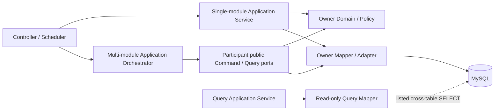
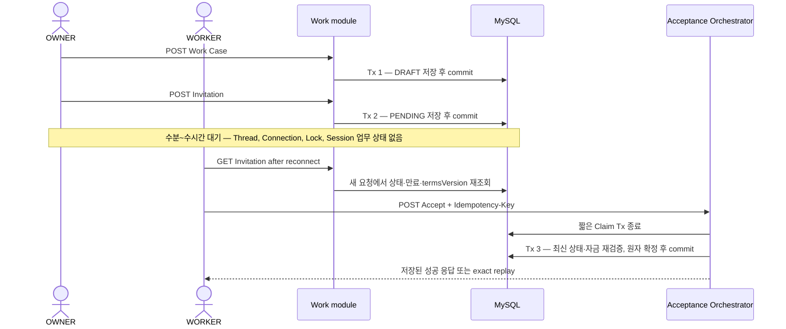

# Module Boundaries and Write Ownership

## 상태와 권위

| 항목               | 값                                                 |
| ------------------ | -------------------------------------------------- |
| 상태               | Accepted architecture contract                     |
| 결정               | `ADR-RF-02`                                        |
| 소유 이슈          | GitHub #283                                        |
| 적용 브랜치        | `dev2`                                             |
| 기준 코드          | `7e45ad3e8227de56298b2f5ceafb5a4b5933c060`         |
| 기준 Schema        | Flyway `202608152345`, 25개 Domain table           |
| 기계 판독 Manifest | [`MODULE_BOUNDARIES.json`](MODULE_BOUNDARIES.json) |

이 문서는 업무 책임, 테이블 쓰기 소유권, 공개 Application 경계, Transaction 조정 위치의
활성 규범이다. 제품 행동은 [`../specs/`](../specs/)가 우선하고, 실제 구현 여부는 코드와
테스트로 판정한다. 이 문서에 목표 Port나 Command를 적었다고 해서 아직 없는 기능이 구현된
것은 아니다.

저장소에는 `SYSTEM_ARCHITECTURE.md`라는 활성 문서가 없다. 이 문서와
[`ARCHITECTURE_OVERVIEW.md`](ARCHITECTURE_OVERVIEW.md)가 그 역할을 나누어 맡으며, 같은
권위의 별도 Architecture 복제본을 만들지 않는다. 이 결정은 실제 Mapper·Service 이동,
기능 공백 구현, Migration 변경을 포함하지 않는다.

`MUST`, `MUST NOT`, `MAY`는 각각 필수, 금지, 허용을 뜻한다.

## 굵은 모듈 경계

현재 Java 최상위 package는 물리 배치일 뿐 독립 bounded module을 뜻하지 않는다.
`work`, `invitation`, `contract`는 하나의 Work 모듈이고, `auth`, `member`, `badge`는 하나의
Member/Auth 모듈이다.

| Module ID            | 현재 package root                               | 소유 책임                                                  | 외부에 공개하는 경계                          |
| -------------------- | ----------------------------------------------- | ---------------------------------------------------------- | --------------------------------------------- |
| `member-auth`        | `auth`, `member`, `badge`, local-only `support` | 계정, 인증, Session principal, 비밀번호 재설정, Badge 귀속 | 계정 Command, 인증 결과, 최소 Member Query    |
| `workplace`          | `workplace`                                     | OWNER 사업장, 좌표·인증 반경 Snapshot                      | Workplace Command와 소유권/표시 Query         |
| `work`               | `work`, `invitation`, `contract`                | Work Case, Invitation, Contract Snapshot과 장기 생명주기   | Work/Invitation/Contract Command와 Read Model |
| `attendance`         | `attendance`                                    | 사업장 고정 QR, 출퇴근 기록, 근태 판정 사실                | Attendance Command/Query와 Work 전이 요청     |
| `wallet`             | `wallet`                                        | KRW Wallet, 충전·출금, Escrow, 불변 Ledger                 | Wallet/Escrow Command와 잔액/원장 Query       |
| `bank-adapter`       | `bank`                                          | Mock bank account와 transfer adapter                       | `BankTransferGateway` 역할                    |
| `settlement`         | `settlement`                                    | Settlement 예약·지급·환불 정책과 Deferred Dispute          | Settlement Command/Query                      |
| `document`           | `document`                                      | 문서 Metadata, Version, Signature, Share, 파일 접근 감사   | Document/Artifact Command와 허용된 파일 Query |
| `idempotency-common` | `idempotency`, `common`, `config`, `health`     | 멱등 Claim과 공유 기술 정책·설정·진단                      | Claim Service와 기술 공통 타입                |
| `notification`       | `notification`                                  | 인앱 알림 적재와 수신자별 목록·읽음 상태                   | Notification Command와 수신자 Query           |

`support`는 `@Profile("local")`로만 활성화되는 Member/Auth 지원 adapter이며 독립 업무 모듈이
아니다. 모든 Controller가 `AuthPrincipal`을 받는 것은 인증 Web 경계 사용이며, 이를 Domain
객체나 타 모듈 persistence 접근 권한으로 해석하지 않는다.



필수 의존 규칙은 다음과 같다.

1. Controller와 Scheduler는 같은 유스케이스의 Application Service 또는 Orchestrator만
   호출해야 한다.
2. 모듈 내부 쓰기 Service는 자기 모듈의 Mapper/Adapter만 호출해야 한다.
3. 타 모듈에는 공개 Application Command/Query Port, 의미가 분명한 ID, 최소 Command/Result로
   요청해야 한다. Mapper, XML, Row/Param, 내부 Domain 객체를 import하면 안 된다.
4. 동일 굵은 경계 안의 물리 package 간 호출은 허용하지만, 하위 역할의 상태 정책과 writer는
   표의 owner가 단일하게 관리한다.
5. 공통 package는 업무 객체의 우회 통로가 아니다. 타 모듈 DTO, Row 또는 상태 문자열을
   `common`으로 옮겨 순환 의존을 숨기면 안 된다.
6. provider core는 Orchestrator를 호출하지 않는다. 다중 모듈 유스케이스의 방향은
   `Orchestrator → participant public boundary` 한 방향이다.
7. Workplace→Attendance 생성 participant와 Attendance→Workplace 검증처럼 업무 데이터 흐름이
   양방향이면 consumer-owned Port를 provider adapter가 구현해 Java compile dependency를 한
   방향으로 유지한다. 서로의 Service 구현을 직접 import하는 순환은 허용하지 않는다.

## Work 장기 생명주기

Work 생성부터 계약 확정까지는 하나의 실시간 요청, Java Aggregate 또는 DB Transaction이
아니다.



### 지속 상태와 요청 규칙

- `DRAFT`, `PENDING`, `PROCESSING`은 timeout이나 오류가 아니라 정상적으로 오래 지속될 수 있는
  영속 상태다.
- 요청 사이에는 Thread, Connection, Transaction, Lock, Java 객체 또는 HTTP Session 업무
  상태를 보존하면 안 된다. 화면과 Session의 Snapshot은 권위가 아니다.
- Work 생성, 초대 발급·조회, 초대 수락은 각각 필요한 Transaction을 끝내고 응답해야 한다.
- 각 명령은 Actor, DB 현재 상태, 현재 시각, Worker 배정, `termsVersion`, 만료와 필요한 자금
  Snapshot을 다시 읽어 판정해야 한다.
- 재시작·새로고침·로그아웃 뒤 재로그인해도 영속 상태만으로 다음 명령을 수행할 수 있어야
  한다. 현재 exact replay key 복원과 WORKER 목록 공백은 구현 완료가 아니며 #288과 #293의
  검증 대상이다.
- 초대 발급은 Work Case를 먼저 잠그고 DRAFT·미배정·시작 전·현재 terms version을 다시
  검증한다. 수락은 잠금 아래 같은 조건과 Token hash를 다시 검증한다.
- 만료를 저장하는 조회는 단순 read-only Query가 아니라 상태 전이 Command다. 이름과
  Transaction owner가 이를 드러내야 한다.

### 현재와 목표의 구분

현재 코드도 요청 사이에 장기 Transaction을 유지하지 않고 `DRAFT/PENDING`을 저장한다.
#287에서 직접 Mapper 조합은 같은 Transaction에 참여하는 owner Service 호출로 바뀌었고,
#288에서 이를 `invitation.application.InvitationAcceptanceOrchestrator`라는 명시적 Application
조정 경계로 승격했다. API DTO나 `AuthPrincipal`은 Orchestrator로 전달하지 않고 서버가 유도한
최소 Command와 Result만 사용한다. 저장 Response JSON도 Application의
`InvitationAcceptanceReplaySnapshotCodec` Port 뒤에서 직렬화한다.

## 테이블 쓰기 소유권

모든 Migration과 DDL은 해당 owner module maintainer와 PM/Repository Administrator가 함께
검토한다. 표의 “현재”는 #287 RF-06 적용 결과이며, 원래 감사 수치는 아래 RF-02 baseline에
보존한다. `writer 없음`은 목표 owner만 정했을 뿐 기능을 구현했다는 뜻이 아니다.

| Table                    | Owner              | 허용 Write Mapper/Adapter                     | 외부 Command 역할                         | 허용 Query/Read Model      | 상태 정책 owner    | Migration reviewer            | 현재                                            |
| ------------------------ | ------------------ | --------------------------------------------- | ----------------------------------------- | -------------------------- | ------------------ | ----------------------------- | ----------------------------------------------- |
| `users`                  | Member/Auth        | `member.mapper.UserMapper`                    | 계정 생성·프로필 변경                     | 인증·당사자 최소 Query     | Member/Auth        | Member/Auth + PM/Admin        | 굵은 경계 안 단일 writer                        |
| `password_reset_tokens`  | Member/Auth        | `auth.mapper.PasswordResetTokenMapper`        | reset token 발급·소비·폐기                | active token 확인          | Member/Auth        | Member/Auth + PM/Admin        | writer 없음; 기능 미구현                        |
| `user_badges`            | Member/Auth        | `badge.mapper.UserBadgeMapper`                | badge 재계산 Upsert                       | 단수 badge Projection      | Member/Auth        | Member/Auth + PM/Admin        | 단일 writer; `#182` `BadgeApplicationService` 경유 |
| `workplaces`             | Workplace          | `workplace.mapper.WorkplaceMapper`            | 사업장 생성·허용 변경                     | 소유권·좌표·표시 Snapshot  | Workplace          | Workplace + PM/Admin          | 단일 writer; 외부는 공개 Query/lock Service     |
| `work_cases`             | Work               | `work.mapper.WorkCaseMapper`                  | 생성·조건 변경·배정·의미 상태 전이        | Work 목록·상세 Projection  | Work               | Work + PM/Admin               | 단일 writer; 외부는 Work Command participant    |
| `work_invitations`       | Work               | `invitation.mapper.InvitationMapper`          | 발급·수락·만료·폐기                       | 초대 표시/검증 Snapshot    | Work               | Work + PM/Admin               | 단일 writer                                     |
| `work_contracts`         | Work               | `contract.mapper.WorkContractMapper`          | 수락 시 불변 Contract Snapshot 생성       | 당사자·계약 Snapshot       | Work               | Work + PM/Admin               | 논리 owner 내부 단일 writer                     |
| `qr_tokens`              | Attendance         | `attendance.mapper.QrTokenMapper`             | 고정 QR 발급·재발급·폐기                  | 활성 QR 검증               | Attendance         | Attendance + PM/Admin         | 단일 writer                                     |
| `attendance_records`     | Attendance         | `attendance.mapper.AttendanceRecordMapper`    | 출근·퇴근 시도 기록                       | 근태 이력·Work 판정 사실   | Attendance         | Attendance + PM/Admin         | 단일 writer; 성공·거절 스캔 감사 기록           |
| `wallets`                | Wallet             | `wallet.mapper.WalletMapper`                  | 기본 지갑, 충전·출금, hold/release        | 잔액 Snapshot              | Wallet             | Wallet + PM/Admin             | 단일 writer; 외부는 Wallet participant          |
| `funding_orders`         | Wallet             | `wallet.mapper.FundingMapper`                 | 충전 주문 실행·완료                       | 충전 replay/result         | Wallet             | Wallet + PM/Admin             | 단일 writer                                     |
| `withdrawal_requests`    | Wallet             | `wallet.mapper.WithdrawalMapper`              | 출금 요청 실행·완료                       | 출금 replay/result         | Wallet             | Wallet + PM/Admin             | 단일 writer                                     |
| `wallet_transactions`    | Wallet             | `wallet.mapper.WalletMapper`                  | owner가 원자 자금 명령과 함께 ledger 기록 | 거래내역·replay Projection | Wallet             | Wallet + PM/Admin             | 단일 writer; hold/release participant 내부 기록 |
| `escrows`                | Wallet             | `wallet.mapper.WalletMapper`                  | 임금 hold·release·refund                  | Escrow 상태·금액 Snapshot  | Wallet             | Wallet + PM/Admin             | 단일 writer; hold/release participant 내부 변경 |
| `mock_bank_accounts`     | Bank Adapter       | `bank.mapper.MockBankMapper`                  | 계좌 lock·입출금 Adapter                  | 계좌 식별·잔액 Snapshot    | Bank Adapter       | Bank Adapter + PM/Admin       | 단일 writer                                     |
| `mock_bank_transactions` | Bank Adapter       | `bank.mapper.MockBankMapper`                  | transfer 결과 ledger                      | bank transfer 조회         | Bank Adapter       | Bank Adapter + PM/Admin       | 단일 writer                                     |
| `settlements`            | Settlement         | `settlement.mapper.SettlementMapper`          | 예약·선점·완료·환불 종료                  | Settlement 상태 Projection | Settlement         | Settlement + PM/Admin         | 단일 writer; 수락은 예약 participant 호출       |
| `disputes`               | Settlement         | `settlement.mapper.DisputeMapper`             | 분쟁 생성·처리                            | 당사자 분쟁 Projection     | Settlement         | Settlement + PM/Admin         | 단일 writer                                     |
| `dispute_ai_reviews`     | Settlement         | `settlement.mapper.DisputeReviewMapper`       | DEMO 검토 작업·결과·실패 감사 기록        | 당사자 DEMO 결과 Projection | Settlement       | Settlement + PM/Admin         | 단일 writer; 외부 호출은 Transaction 밖에서 수행 |
| `documents`              | Document           | `document.mapper.ContractDocumentWriteMapper` | 문서 Metadata 생성·상태 변경              | 문서 목록·접근 Projection  | Document           | Document + PM/Admin           | 단일 writer                                     |
| `document_versions`      | Document           | `document.mapper.ContractDocumentWriteMapper` | Version 생성·Artifact 연결                | 허용 Version Projection    | Document           | Document + PM/Admin           | 단일 writer                                     |
| `document_signatures`    | Document           | `document.mapper.ContractDocumentWriteMapper` | 서명 증거 기록                            | 서명 검증 Projection       | Document           | Document + PM/Admin           | 단일 writer                                     |
| `document_shares`        | Document           | `document.mapper.ContractDocumentWriteMapper` | 당사자 Share 생성·폐기                    | 문서함 Projection          | Document           | Document + PM/Admin           | 단일 writer                                     |
| `document_access_logs`   | Document           | `document.mapper.DocumentAccessMapper`        | 접근 결과 감사 기록                       | 감사 Query                 | Document           | Document + PM/Admin           | 단일 writer                                     |
| `idempotency_requests`   | Idempotency/Common | `idempotency.mapper.IdempotencyClaimMapper`   | claim·complete·abandon·expiry cleanup     | exact replay Snapshot      | Idempotency/Common | Idempotency/Common + PM/Admin | 단일 writer                                     |
| `notifications`          | Notification       | `notification.mapper.NotificationMapper`      | 이벤트별 알림 적재·읽음 처리              | 수신자 목록·안읽음 개수    | Notification       | Notification + PM/Admin       | 단일 writer, Mapper는 #384에서 만든다           |

### 쓰기 소유권 해석

- “하나의 owner”는 업무 상태·DML·공개 Command 책임이 하나의 논리 모듈에 있다는 뜻이다.
  owner 내부에서 역할별 Mapper를 나눌 수 있지만, 한 table의 DML은 표와 Manifest의 정확한
  writer type 하나로 수렴한다. 이름을 바꾸면 같은 PR에서 Manifest도 바꾼다.
- 외부 모듈이 owner Mapper를 직접 주입하면 SQL 파일이 하나여도 소유권 위반이다.
- owner Command는 권한, 상태 정책, expected-state DML, 영향 행 수, Lock과 의미 오류를
  캡슐화해야 한다. 단순 1:1 Mapper wrapper를 만들라는 뜻은 아니다.
- writer가 없는 테이블은 `missing`으로 유지한다. #283 때문에 비밀번호 재설정, Badge
  기능을 새로 구현하지 않는다.

## 공개 Application 경계

아래 이름은 반드시 같은 Java interface 이름을 강제하지 않는 역할 계약이다. 실제 타입은
Application Command/Result여야 하며 Controller DTO, MyBatis Row/Param, 내부 Domain 객체를
노출하면 안 된다.

| Provider           | 공개 역할과 최소 입출력                                                                                | 의미 실패                                          | Transaction·Lock 계약                                                                                                |
| ------------------ | ------------------------------------------------------------------------------------------------------ | -------------------------------------------------- | -------------------------------------------------------------------------------------------------------------------- |
| Member/Auth        | 계정 생성, 인증, 당사자 이름/역할 Query → user ID·최소 identity                                        | 중복, 인증 실패, 비활성, 역할 불일치               | 단일 계정 명령은 owner; signup의 Wallet 생성은 participant 호출                                                      |
| Workplace          | 사업장 생성·허용 변경, 소유권/좌표 Snapshot → workplace ID·검증 값                                     | 없음, 비소유, 비활성, 좌표 미확정                  | 단일 명령 owner; Work/Attendance에는 Query만 제공                                                                    |
| Work               | Work 생성·조건 변경, Invitation 발급/수락 part, Contract Snapshot, 의미 상태 전이 → IDs·version·status | 만료, 폐기, version 충돌, 잘못된 상태, 이미 배정   | 단일 명령 owner; acceptance에서는 participant, Work Case를 먼저 lock                                                 |
| Attendance         | QR 발급/재발급, scan fact 기록, 근태 Query → attendance fact/status                                    | QR 무효, 위치 실패, 중복 성공, 적용 근무 불명확    | Attendance 명령 owner; Work 상태는 Work Command participant에 요청                                                   |
| Wallet             | 지갑 생성, funding/withdrawal, Escrow hold/release/refund와 ledger → wallet/escrow ID·금액 Snapshot    | 잔액 부족, currency/actor 불일치, ledger integrity | 금융 명령 owner 또는 Orchestrator participant; `(userId, KRW)`를 wallet ID로 한 번 해석한 뒤 wallet ID 오름차순 lock |
| Bank Adapter       | 계좌 resolve/lock, debit/credit → adapter result/reference                                             | 계좌 없음, PIN 실패, 잔액 부족, adapter 실패       | Wallet Transaction에 참여하는 Adapter; 내부 table만 write                                                            |
| Settlement         | 예약, payout 선점·완료, 상태 Query → settlement ID·status·amount                                       | 지급 불가 상태, 이미 처리, replay·원장 불일치      | 예약은 acceptance participant; 수동 승인 또는 Scheduler 건별 Tx가 payout outer owner                                 |
| Document           | Contract artifact prepare, metadata/version/share/signature, access audit → document/version handle    | 접근 거부, checksum/storage 실패                   | acceptance participant; commit 전 pending, commit 후 promotion                                                       |
| Idempotency/Common | claim, complete, abandon, replay → claim ID 또는 저장 응답                                             | key/fingerprint 충돌, 처리 중, 만료                | claim/abandon은 별도 짧은 Tx; complete는 업무 outer Tx의 마지막 participant                                          |

### RF-06 실제 공개 경계

| Provider     | 공개 interface                                                                      | 적용된 호출자와 책임                                                                |
| ------------ | ----------------------------------------------------------------------------------- | ----------------------------------------------------------------------------------- |
| Member/Auth  | `MemberIdentityQueryService`                                                        | Work 계약 Snapshot에 필요한 최소 `userId/name` Query                                |
| Workplace    | `WorkplaceOwnershipService`의 active/owner Query와 owner lock                       | Auth onboarding, Attendance QR 검증·재발급                                          |
| Work         | `AcceptanceWorkParticipant`, `WorkLifecycleCommandService`, `WorkSettlementService` | 수락 확정, Attendance 상태 전이, Settlement의 COMPLETED Work 조회·lock              |
| Wallet       | `WalletProvisionService`, `AcceptEscrowHold`, `SettlementWalletService`             | 가입 지갑 생성, 수락 Escrow hold, 정산 release·양측 ledger                          |
| Settlement   | `SettlementReservationService`, `SettlementPayoutExecutor`                          | 수락 Transaction 안의 WAITING 예약, 수동·자동 호출자가 공유하는 MANDATORY 원자 지급 |
| Document     | `SignedContractArtifactQueryService`, `DocumentQueryService`                        | Attendance artifact 검증과 Controller 조회 경계                                     |
| Member/Badge | `BadgeApplicationService`                                                           | Controller와 인증된 초대 조회(`InvitationQueryServiceImpl`)가 공유하는 잠금·재계산·Upsert 경계 |

쓰기 participant는 모두 호출자의 outer Transaction에 `MANDATORY`로 참여하고 독립 commit하지
않는다. Query Service는 persistence Row/Param을 외부 interface에 노출하지 않는다.

외부 caller가 rollback, retry, 응답을 구분할 수 있을 때만 의미 오류를 나눈다. SQL 예외,
DuplicateKey, storage key, 내부 status string은 공개 결과가 아니다.

## 허용 호출 방향

아래 표에 없는 타 모듈 업무 호출은 새 Architecture 결정 없이 추가하면 안 된다. `Query`는
최소 Snapshot 또는 consumer-owned Projection만 반환하고, `Command participant`는 명시된
Orchestrator Transaction에 참여한다.

| Caller / Orchestrator                  | Provider boundary                               | Kind                        | 허용 목적                                                |
| -------------------------------------- | ----------------------------------------------- | --------------------------- | -------------------------------------------------------- |
| Member/Auth Application                | Workplace                                       | Query                       | OWNER onboarding에 필요한 active Workplace 존재 여부     |
| Signup Orchestrator                    | Wallet                                          | Command participant         | 사용자와 기본 KRW Wallet 원자 생성                       |
| Workplace create Orchestrator          | Attendance                                      | Command participant         | 사업장 생성과 초기 고정 QR 발급                          |
| Work Application                       | Member/Auth, Workplace                          | Query                       | 계약 당사자·사업장 불변 Snapshot과 초대 발급 OWNER의 배지 재계산 |
| Attendance Application                 | Work                                            | Command                     | 근태 사실에 따른 의미 상태 전이 요청                     |
| Attendance Application                 | Workplace, Document                             | Consumer-owned Query Port   | 사업장 권한/좌표와 signed artifact 준비 여부             |
| Wallet Application                     | Bank Adapter                                    | Adapter command             | Mock 계좌 lock과 debit/credit                            |
| Invitation Acceptance Orchestrator     | Idempotency, Work, Wallet, Document, Settlement | Command participant         | 수락 순간의 원자 확정                                    |
| Settlement approval / scheduled payout | Idempotency, Work, Settlement, Wallet           | Query + Command participant | 완료 상태 소비와 원자 지급; 외부 오류 변환은 호출자 소유 |
| Document Application                   | Work                                            | Consumer-owned Query Port   | 계약 당사자 파일 접근 판정                               |

Workplace→Attendance와 Attendance→Workplace처럼 데이터 흐름이 양방향이어도 구현 package의
서로 참조는 허용하지 않는다. consumer package에 Port를 두고 provider adapter가 이를 구현해
한 compile 방향으로 정렬하거나, 이미 허용된 read Projection으로 해결한다. 공개 Service 구현,
Mapper, Row/Param을 역방향으로 import하면 순환 의존 위반이다.

## Orchestrator와 Transaction 정책

### 역할 구분

| 역할                      | 책임                                                                               | 금지                                                        |
| ------------------------- | ---------------------------------------------------------------------------------- | ----------------------------------------------------------- |
| Domain Service/Policy     | Framework 없는 상태 규칙, 값 계산, 허용 명령 판단                                  | Transaction, Mapper, HTTP DTO 의존                          |
| Owner Application Service | 한 모듈 명령의 인증·정책·Transaction·owner Mapper 조정                             | 타 모듈 Mapper 호출                                         |
| Application Orchestrator  | 여러 모듈이 함께 commit돼야 하는 사용자 유스케이스의 outer Transaction과 Lock 순서 | 직접 Mapper 호출, 장기 상태 보존, participant별 독립 commit |
| Query Application Service | 권한과 API allowlist를 적용하고 Projection 반환                                    | 상태 변경을 read-only로 위장                                |

Orchestrator는 복합 유스케이스에만 둔다. Work Case CRUD, 사업장 조회, 문서 목록처럼 한 owner나
read projection으로 끝나는 요청에 Orchestrator를 만들지 않는다.

### 승인된 조정 경계

| Use case              | Outer owner                                            | 순서와 잠금                                                                                                                            | Commit 경계                                                                                                                                     |
| --------------------- | ------------------------------------------------------ | -------------------------------------------------------------------------------------------------------------------------------------- | ----------------------------------------------------------------------------------------------------------------------------------------------- |
| Signup                | Member/Auth Application                                | Member uniqueness/insert → Wallet provision participant                                                                                | 사용자와 기본 Wallet을 한 짧은 Tx로 commit                                                                                                      |
| Workplace creation    | Workplace Application                                  | Workplace 검증·insert → Attendance initial QR participant                                                                              | 사업장과 최초 고정 QR을 한 짧은 Tx로 commit                                                                                                     |
| Invitation acceptance | `InvitationAcceptanceOrchestrator`                     | 별도 Claim Tx 종료 → `work_cases` → `work_invitations` → KRW wallet ID 해석·lock → owner writes → Claim complete                       | Work·Invitation·Contract·Escrow·Ledger·Document metadata·Settlement 예약이 한 `REQUIRES_NEW` Tx                                                 |
| Settlement payout     | 수동 `SettlementApprovalTransaction` 또는 #172 건별 Tx | `work_cases` → `settlements` → `disputes` → `escrows` → KRW wallet ID 해석 → wallet ID 오름차순 lock → expected-state·자금·양측 ledger | `SettlementPayoutExecutor`는 `MANDATORY`; 수동 Claim complete는 같은 `REQUIRES_NEW` Tx의 마지막 단계이며 Scheduler는 `approved_by_user_id=null` |

participant는 기존 outer Transaction 참여를 요구해야 하며 업무 데이터를 `REQUIRES_NEW`로
독립 commit하면 안 된다. Claim 선점·abandon처럼 별도 commit이 계약상 필요한 예외만 역할
이름과 crash window를 문서화한다.

- Idempotency Claim은 별도 `REQUIRES_NEW`로 먼저 commit하지만 Work/Invitation/Wallet Lock과
  함께 수시간 보유하지 않는다. `PROCESSING` Claim은 `expires_at` 전에는 탈취하지 않고 즉시
  409로 끝나며 현재 보존 기간은 24시간이다. 외부 `Retry-After` Header는 추가하지 않는다.
- deadlock/lock-timeout 재시도 단위는 participant 한 단계가 아니라 같은 idempotency context를
  사용하는 전체 Orchestrator 명령의 새 `REQUIRES_NEW` Transaction이다. 최대 세 번 시도하며
  중간 실패에서는 Claim을 유지하고 최종 소진 또는 비재시도 실패에서만 abandon한다.
- DB Lock 보유 중 외부 네트워크나 무제한 I/O를 실행하면 안 된다. 현재 계약 artifact 준비는
  DB Snapshot의 제한된 필드로 고정된 두 개의 단일 페이지 PDF를 로컬 Storage에 쓰는 경계만
  허용한다. prepare 실패는 전체 Rollback, commit 후 promotion 실패는 pending fallback으로
  복구하며 별도 participant Transaction을 만들지 않는다. 다만 동기 `Files.write` 자체를
  중단하는 wall-clock timeout은 현재 강제하지 않으므로 느린 로컬 디스크는 잔여 운영 위험이다.
- commit 후 artifact promotion 실패는 이미 commit된 수락을 되돌리지 않는다. 검증된 pending
  artifact fallback과 운영 재시도 책임을 보존한다.

## 조회 Projection 예외

목록·상세·대시보드·접근 권한용 cross-table JOIN은 다음 조건에서만 허용한다.

1. Mapper method와 SQL이 `SELECT`만 수행한다.
2. 결과는 consumer가 소유하는 Query Projection이며 Domain Aggregate나 persistence Row를 외부
   모듈에 전달하지 않는다.
3. API 변환은 storage key, token hash, password hash, 내부 bank identifier 등 비공개 값을
   allowlist 밖으로 내보내지 않는다.
4. owner table 쓰기 권한은 생기지 않는다. Query 예외에 DML을 추가하면 즉시 위반이다.
5. N회 원격 Service 호출 모양으로 억지 분해하는 것보다 하나의 명시적 read projection을
   사용한다.

| ID       | Consumer mapper                               | 허용 cross-table SELECT                                                | 목적                                  | 후속 정리                                          |
| -------- | --------------------------------------------- | ---------------------------------------------------------------------- | ------------------------------------- | -------------------------------------------------- |
| `QX-001` | `work.mapper.WorkCaseMapper`                  | users, workplaces, attendance_records, escrows, settlements, documents | Work 목록·상세                        | query 역할 분리는 #287/#291                        |
| `QX-002` | `wallet.mapper.WalletQueryMapper`             | work_cases, workplaces                                                 | Wallet 거래내역 표시                  | 유지 가능한 Read Model                             |
| `QX-003` | `document.mapper.DocumentQueryMapper`         | users, work_contracts, work_cases, workplaces                          | 역할별 문서 목록·공유 이력            | #132의 권한/비공개 값 계약 유지                    |
| `QX-004` | `document.mapper.DocumentAccessMapper`        | users, work_contracts, work_cases, workplaces                          | 계약 당사자·보건증 공유 접근 판정     | Document Query Port로 캡슐화                       |
| `QX-005` | `attendance.mapper.AttendanceLifecycleMapper` | work/invitation/contract, wallet/settlement, workplace/document tables | lifecycle 후보·준비 Projection        | DML/FOR UPDATE 제거; Work lock·전이는 공개 Command |
| `QX-006` | `badge.mapper.BadgeEvidenceSourceMapper`      | settlements, disputes, work_cases, attendance_records                  | 신뢰 배지 OWNER·WORKER 원천 이력 집계 | `#182` 구현. DML 금지, 원천 재계산 전용            |

`AttendanceLifecycleMapper`는 Scheduler batch와 READY 선행조건을 한 번에 읽는 consumer-owned
Projection이다. #287에서 `work_cases` DML을 제거했고, 실제 상태 전이는
`WorkLifecycleCommandService`만 수행한다. `WorkContractMapper`의 `users` JOIN은 제거하고
`MemberIdentityQueryService`로 이동했다. QX-005에 DML을 다시 추가하면 즉시 위반이다.

`BadgeEvidenceSourceMapper`는 `#182`가 도입한 Member/Badge 소유 Query 예외다. `user_badges`를
쓰지 않고 OWNER 정산·분쟁, WORKER 근무·출퇴근 원천만 읽어 누적·정상 건수를 집계한다. Work·
Attendance·Settlement 모듈은 이 Mapper를 참조하지 않으며, 계산 결과는 Badge Application
Service가 `user_badges` Upsert에만 사용한다. QX-006에 DML을 추가하면 즉시 위반이다.

## 남은 위반과 단일 후속 소유자

#287에서 TV-001~TV-007을 제거했고 #291에서 TV-008의 API/Domain→persistence 타입 의존을,
#286에서 TV-009의 분산된 Work/Invitation 상태 정책을 제거했다. 아래 남은 항목은 기능 공백을
임의 구현하지 않고 명시된 검증 이력이 추적한다.

| ID       | 현재 근거                              | 위반                                                                             | Primary 후속 이슈              |
| -------- | -------------------------------------- | -------------------------------------------------------------------------------- | ------------------------------ |
| `TV-010` | 새로고침·재로그인 뒤 client replay key | Backend Claim·pending 복구는 #288에서 고정됐으나 response-loss Key 복원은 미구현 | 검증 #160/#267; 구현 이슈 없음 |

`password_reset_tokens`의 writer 부재는 이 표의 리팩터링 위반을 고치기 위한 신규 기능 허가가
아니다. 원래 기능 이슈 또는 Deferred 상태를 유지한다. `disputes`는 `#387`의
`settlement.mapper.DisputeMapper`, `user_badges`는 `#182`의
`badge.mapper.UserBadgeMapper`가 각각 유일한 writer로 붙어 이 목록에서 제외됐다.

## Domain과 타입 경계

- Domain package는 Spring, MyBatis, Servlet, Jackson, Controller Request/Response를 import하면
  안 된다.
- API Request/Response, Application Command/Result, Domain Model/Policy, Mapper Row/Param을
  역할이 다를 때만 분리한다. Query Projection은 명시적 read-only 예외다.
- Controller Request를 Domain mutable object로 사용하지 않고, Mapper Row/Param을 Service
  interface 밖으로 반환하지 않는다.
- Domain 오류는 상태 전이와 caller 행동을 표현하고, Application이 승인된 HTTP 오류로
  변환한다.
- 현재 production `domain` 경로의 금지 import 감사 결과는 0건이다. 완료된 #286·#291·#294
  결과를 포함해 이 baseline을 유지한다.

금지 예시는 다음과 같다.

```java
// 금지: Controller가 persistence를 직접 사용
private final WorkCaseMapper workCaseMapper;

// 금지: 다른 모듈의 MyBatis Row를 공개 Service 결과로 반환
WalletBalanceRow holdEscrow(AcceptRequest request);

// 허용 방향: HTTP 독립 Command와 최소 Result
EscrowHoldResult holdEscrow(EscrowHoldCommand command);
```

## Architecture decision record

### ADR-RF-02 — 굵은 모듈, 단일 writer, 짧은 Orchestrator

- **Status:** Accepted
- **Date:** 2026-08-10
- **Context:** 패키지별 기능 구현이 `work_cases`, Wallet, Document 쓰기를 여러 caller에
  분산시켰고, 수시간 Work 생명주기와 수락 순간의 짧은 원자 명령이 혼동될 위험이 있었다.
- **Decision:** 10개 굵은 논리 모듈, 26개 테이블의 단일 write owner, 공개 Application 경계,
  read-only JOIN 예외, use-case Orchestrator가 소유하는 outer Transaction을 채택한다.
- **Consequences:** `work`/`invitation`/`contract`와 `auth`/`member`/`badge`의 물리 package는
  유지할 수 있다. #287에서 직접 Mapper 호출을 owner Service로 옮겼고, #288에서 수락 조정을
  명시적 Orchestrator와 전체 Transaction 재시도 계약으로 고정했다.
  Query를 무의미하게 여러 Service 호출로 분해하지 않는다. 새 Framework, Saga, Outbox,
  generic Repository는 도입하지 않는다.
- **Alternatives rejected:** package 하나당 독립 module, Work 전체 장기 Transaction, 모든
  조회 JOIN 금지, 모든 테이블 generic Repository, 기능 공백의 리팩터링 PR 동시 구현.

## 검증과 변경 절차

이 문서와 Manifest를 바꿀 때 다음을 함께 검증한다.

1. Manifest의 owner table 집합이 현재 Flyway Head와 통합 DDL의 25개 Domain table과 정확히
   일치하는지 검사한다.
2. production Java의 타 논리 모듈 Mapper import와 Controller Mapper import를 재감사한다.
3. Mapper XML의 DML table을 owner package와 비교하고, Query 예외 SQL에 DML이 없는지
   검사한다.
4. Domain 금지 import와 공개 Service의 Row/Param 노출을 검사한다.
5. Mermaid, Markdown/JSON 형식과 모든 상대 링크를 검사한다.
6. owner, 허용 호출 방향, Orchestrator participant, Query 예외를 바꾸면 같은 PR에서 이 문서,
   Manifest, 관련 package documentation을 원자적으로 갱신한다.
7. 실제 Migration/DDL 변경은 별도 권한과 해당 이슈 범위에서만 수행한다.

RF-03 Guardrail은 [`MODULE_BOUNDARIES.json`](MODULE_BOUNDARIES.json)을 읽어 module package,
금지 import와 production Mock 경계를 검사한다. 비교 기준과 후보의 위반을 `rule + file + import
target/mock symbol` signature로 비교하므로 기존 위반을 다른 파일로 옮기거나 같은 수의 신규
위반으로 교체할 수 없다. temporary violation은 해당 owner 이슈에서 제거해야 하며 신규
signature는 허용하지 않는다.

### RF-02 감사 baseline

| 검사                                         | `dev2@7e45ad3` 결과     | 목표                                     |
| -------------------------------------------- | ----------------------- | ---------------------------------------- |
| Flyway Head 통합 DDL table ↔ Manifest owner  | 24 ↔ 24, 누락·중복 0    | 항상 정확히 일치                         |
| Production 타 논리 모듈 `.mapper.` import    | 13 statements / 7 files | #287 완료 시 0                           |
| Production Controller `.mapper.` import      | 2 statements / 2 files  | #287 완료 시 0                           |
| Domain Framework/Web/Persistence 금지 import | 0                       | 0 유지                                   |
| Production hardcoded Mock flag               | 4                       | #293 완료 시 0                           |
| 현재 writer가 없는 table                     | 4                       | 기능 이슈 상태를 유지하고 거짓 완료 금지 |
| 명시된 cross-table Query 예외                | 5                       | Manifest allowlist 밖 신규 예외 0        |
